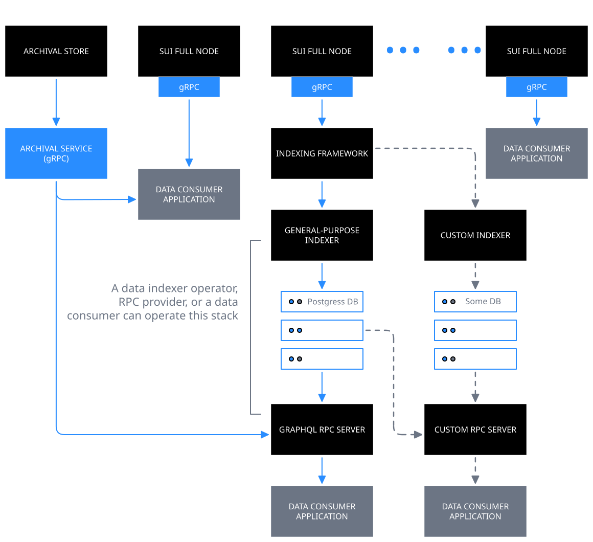

애플리케이션을 구축하고, network behavior를 분석하고, network activity를 audit하기 위해 서로 다른 interface를 통해 [transactions](/develop/transactions/txn-overview), [checkpoints](/develop/sui-architecture/checkpoint-verification), [objects](/develop/sui-architecture/object-model), [events](/develop/accessing-data/using-events) 같은 Sui network data에 접근한다.

Sui data에 접근하는 primary interface는 다음과 같다:

- [gRPC API](/develop/accessing-data/grpc): full node에서 JSON-RPC를 대체한다. 이미 JSON-RPC를 사용하고 있거나 사용 사례의 dependency로 활용하기 시작했다면 JSON-RPC는 **deprecated**되었으며 gRPC 또는 GraphQL RPC로 migrate해야 한다.

- [GraphQL RPC](/develop/accessing-data/graphql/graphql-rpc): General-Purpose Indexer([custom indexing framework](/develop/accessing-data/custom-indexer/custom-indexers)의 performant하고 scalable한 구현)의 relational database에서 data를 읽는 데 사용할 수 있는 lightweight service이다. 기존 application의 JSON-RPC migration을 포함해 gRPC의 alternative로 사용할 수 있다.

- [Archival Store and Service](/develop/accessing-data/archival-store): pruning 때문에 full node에서 더 이상 사용할 수 없을 수 있는 historical network data에 대한 long-term storage와 access를 제공한다. primary data access mechanism으로 gRPC를 사용하는 경우 endpoint를 full node에서 Archival Service로 변경해 gRPC `LedgerService` API로 query할 수 있다. GraphQL RPC를 사용하는 경우 추상화되어 있으므로 직접 상호작용할 필요가 없다.

- [Custom indexers](/develop/accessing-data/custom-indexer/custom-indexers): custom indexing framework를 사용해 application-specific data를 위한 [pipeline을 직접 만든다](/develop/accessing-data/custom-indexer/build).

## 최신 data access interface

:::info
latest 및 legacy Sui data stack의 비교는 아래 video를 확인한다.
<iframe width="560" height="315" src="https://www.youtube.com/embed/CL7H4QQSWd0?si=Mt2xo3HNfm2mbRtE" title="YouTube video player" frameborder="0" allow="accelerometer; autoplay; clipboard-write; encrypted-media; gyroscope; picture-in-picture; web-share" referrerpolicy="strict-origin-when-cross-origin" allowfullscreen></iframe>
:::

## 지원 SDK

다음 SDK를 사용하여 Sui의 data와 상호작용할 수 있다.

- [TypeScript SDK](https://sdk.mystenlabs.com/sui/migrations/sui-2.0/json-rpc-migration)

- [Rust SDK - gRPC](https://github.com/MystenLabs/sui-rust-sdk)

- [Rust SDK - GraphQL](https://docs.rs/sui-graphql/latest/sui_graphql/)

- community-maintained [Python SDK](https://github.com/FrankC01/pysui)

## General-purpose Indexer에서 gRPC 또는 GraphQL을 사용하는 시점

다음 표에 언급된 high-level criteria를 사용하여 gRPC API와 General-purpose Indexer를 사용하는 GraphQL RPC 중 어느 쪽이 사용 사례에 더 적합한지 판단할 수 있다. 이 목록은 exhaustive하지 않으며 일부 사용 사례에는 두 option 모두 적절하게 동작할 수 있다.

| 관점 | gRPC API | General-purpose Indexer 기반 GraphQL RPC |
| -------- | ------- | ------- |
| Type of application or data consumer. | Web3 exchange, DeFi market maker app, ultra low-latency need가 있는 기타 DeFi protocol 또는 app에 적합하다. | web application builder 또는 latency need가 다소 완화된 builder에 적합하다. |
| Query patterns. | 서로 다른 endpoint에서 data를 별도로 읽고 client-side에서 결합해도 괜찮다. binary format 덕분에 serialization, parsing, validation이 더 빠르다. | 단일 request에서 서로 다른 table의 data를 결합할 수 있어 client를 더 쉽게 decouple할 수 있으며, paginated result를 포함해 유사한 checkpoint 전반에서 서로 다른 table의 consistent data를 반환한다. |
| Retention period requirements. | default retention period는 2주이며 실제 configuration은 full node operator의 needs and goals에 따라 달라진다. 표 아래의 history-related information을 참조한다. | Postgres database의 default retention period는 4주이며 실제 configuration은 사용자의 needs 또는 RPC provider나 data indexer operator의 setup에 따라 달라진다. 표 아래의 history-related information을 참조한다. |
| Streaming needs. | beta release 전에 streaming 또는 subscription API가 포함된다. | Subscription API가 계획되어 있지만 GA 이후에 사용할 수 있다. |
| Incremental costs. | 이미 full node JSON-RPC를 사용하고 있다면 incremental costs가 거의 없거나 전혀 없다. | 이미 full node JSON-RPC를 사용하고 있고 retention period 및 query pattern 차이가 중요하지 않다면 incremental costs가 다소 크다. |

이 표는 두 option의 default retention period만 언급한다. full node operator, RPC provider, 또는 data indexer operator가 performance에 큰 영향을 주지 않고 이를 몇 배 더 높게 구성할 수 있을 것으로 예상된다. 또한 기본적으로 GraphQL RPC service는 underlying Postgres database에 구성된 retention period를 넘는 historical data에 대해 Archival Store and Service에 직접 연결할 수 있다. 반면 gRPC API에는 Archival Store and Service에 대한 이러한 direct connectivity가 없으므로 application에서 직접 연결해야 한다.

gRPC와 GraphQL의 일반적인 차이를 설명하는 다음 글을 참조한다. 차이점의 정확성과 authenticity는 직접 실험해 검증한다.

- https://stackoverflow.blog/2022/11/28/when-to-use-grpc-vs-graphql/
- https://blog.postman.com/grpc-vs-graphql/

## Legacy data access interface

:::info

<ImportContent source="json-rpc-deprecation" mode="snippet" />

:::

Sui [full nodes](/operators/full-node/sui-full-node)에 hosted된 [JSON-RPC](/references/sui-api)에 직접 연결한다. 이 full node는 [RPC providers](https://sui.io/developers#dev-tools)(`RPC`로 filter) 또는 [data indexer operators](https://github.com/sui-foundation/awesome-sui?tab=readme-ov-file#indexers--data-services)가 운영한다. Mainnet, Testnet, Devnet load balancer URL은 Sui Foundation-managed full node를 추상화한다. production에서는 사용하지 않는다.

JSON-RPC를 사용해 real-time 또는 historical data를 얻을 수 있다. historical data의 retention period는 node operator가 구현하는 [pruning strategy](/operators/data-management/managing-data#sui-node-pruning-policy)에 따라 달라지지만, 모든 full node의 default configuration은 Sui Foundation이 관리하는 [Archival Store](/develop/accessing-data/archival-store)로 암묵적으로 fallback한다.
