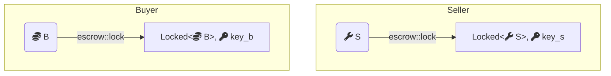
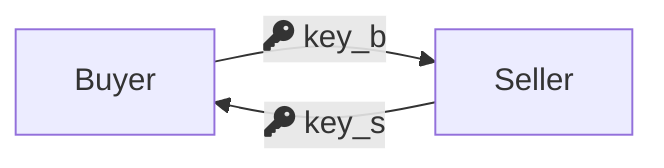
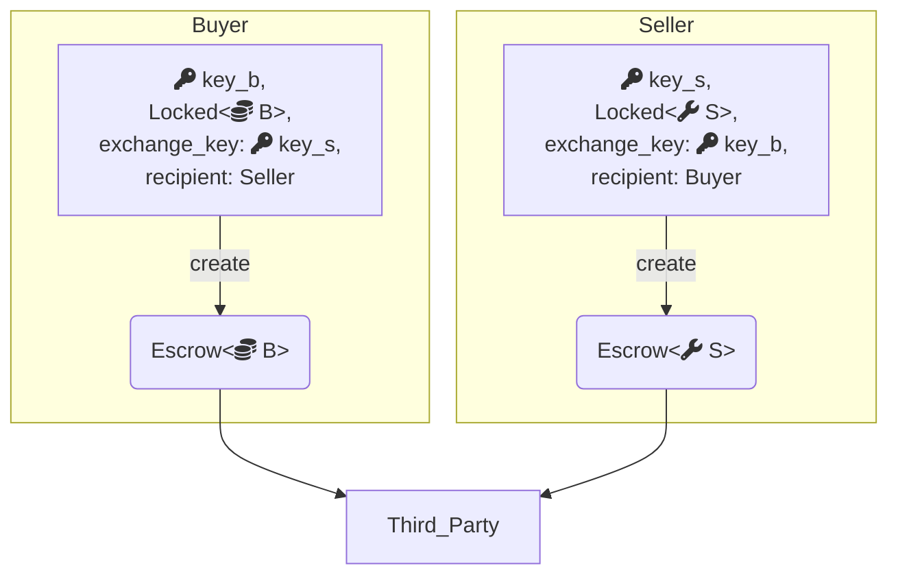
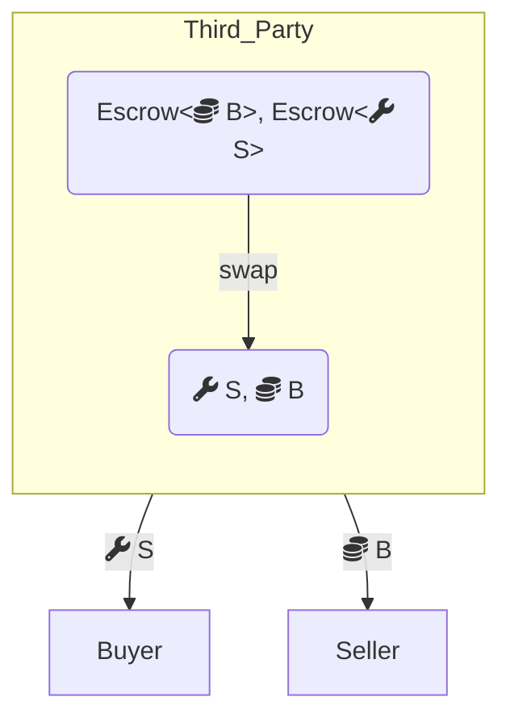
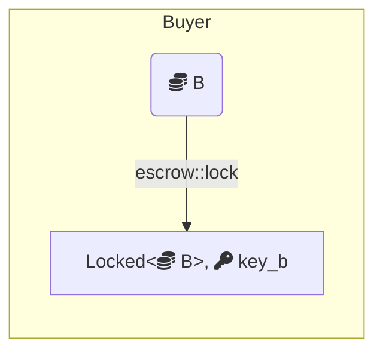
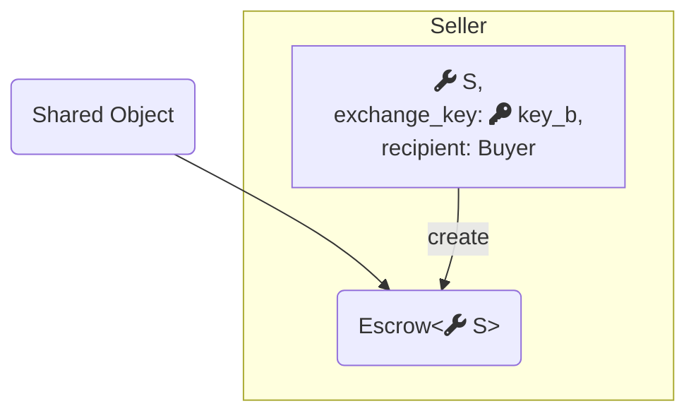
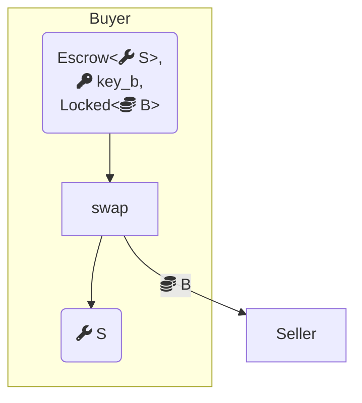

[Move package](/develop/publish-upgrade-packages)는 version이 지정되어 onchain에 저장되지만, 처음부터 immutable이므로 다른 scheme을 따른다. package transaction input은 ID만으로 참조된다. 항상 최신 version으로 load된다.

### 사용자 패키지

publish 또는 upgrade마다 새 ID가 생성된다. 새로 publish된 package는 version 1에서 시작하며, 각 upgrade는 바로 이전 version에서 version을 1씩 증가시킨다. object와 달리 오래된 package version은 upgrade 후에도 계속 accessible하다. 두 번 upgrade된 package는 store에 다음과 같이 나타날 수 있다:

```
(0x17fb7f87e48622257725f584949beac81539a3f4ff864317ad90357c37d82605, 1) => P v1
(0x260f6eeb866c61ab5659f4a89bc0704dd4c51a573c4f4627e40c5bb93d4d500e, 2) => P v2
(0xd24cc3ec3e2877f085bc756337bf73ae6976c38c3d93a0dbaf8004505de980ef, 3) => P v3
```

세 version은 모두 서로 다른 ID에 있으며, `v3`가 존재한 후에도 `v1`을 포함해 계속 호출할 수 있다.

### framework package

`0x1`의 [Move standard library](https://move-book.com/reference/), `0x2`의 [Sui framework](https://docs.sui.io/references/framework/sui_sui), `0x3`의 [Sui system library](https://docs.sui.io/references/framework/sui_system), `0xdee9`의 [DeepBook](/onchain-finance/deepbookv3/deepbook) 같은 framework package는 특별한 case이다. 이들의 ID는 upgrade 전반에서 stable하게 유지되어야 한다. network는 epoch boundary에서 system transaction을 통해 이를 upgrade하며, ID를 유지하면서 version을 증가시킨다:

```
(0x1, 1) => MoveStdlib v1
(0x1, 2) => MoveStdlib v2
(0x1, 3) => MoveStdlib v3
```

### package manifest version

package manifest file은 `[package]` section과 `[dependencies]` 모두에 version field를 포함한다. `publish`와 `upgrade` command는 이를 사용하지 않으므로 user-level documentation 용도일 뿐이다. manifest version이 다른 같은 package의 두 publish는 완전히 별개의 package로 취급되며 서로의 dependency override로 사용할 수 없다.

## fastpath와 consensus 비교

| | fastpath | consensus |
| :-- | :-- | :-- |
| **지원 ownership** | address-owned, immutable | address-owned, party, shared |
| **version input** | 정확한 ID와 version을 지정해야 함 | ID와 shared-at version을 지정하며, consensus가 access version을 assign |
| **latency** | 낮음 | 더 높음 |
| **gas cost** | 낮음 | 더 높음 |
| **multi-party access** | offchain coordination 필요 | onchain에서 처리 |
| **equivocation risk** | 같은 object가 두 transaction에서 사용되면 있음 | 없음 |
| **적합한 대상** | latency-sensitive, single-party 또는 offchain-coordinated app | multi-party coordination, 자주 shared되는 object |

## 예시: escrow swap

이 예시는 동일한 trustless object swap service를 두 방식으로 구현하여 trade-off를 보여준다. 하나는 custodian이 있는 fastpath address-owned object를 사용하고, 다른 하나는 consensus shared object를 사용한다.

두 implementation은 모두 locking primitive를 사용한다:

```move
module escrow::lock {
    public fun lock<T: store>(obj: T, ctx: &mut TxContext): (Locked<T>, Key);
    public fun unlock<T: store>(locked: Locked<T>, key: Key): T
}
```

모든 `T: store`는 lock되어 `Locked<T>`와 corresponding `Key`를 얻을 수 있다. unlock은 key를 consume하므로, key의 ID를 monitoring하면 locked value의 tampering을 detect할 수 있다.

GitHub에서 [complete code](https://github.com/MystenLabs/sui/blob/93e6b4845a481300ed4a56ab4ac61c5ccb6aa008/examples/move/escrow/sources/lock.move)를 확인한다.

### fastpath: address-owned object

<details>
<summary>`owned.move`</summary>

<ImportContent source="examples/trading/contracts/escrow/sources/owned.move" mode="code" />

</details>

양 party는 object를 lock하는 것으로 시작한다. 어느 한쪽이 진행하지 않기로 하면 unlock하고 exit한다.



그런 다음 양 party가 key를 swap한다:



third-party custodian은 object를 보유하고 두 object가 모두 도착하면 match한다. `create` function은 `Escrow` request를 custodian에게 보내며, offered object를 unlock하는 동시에 해당 object가 lock될 때 사용된 key의 ID를 기록한다:

<ImportContent source="examples/trading/contracts/escrow/sources/owned.move" mode="code" fun="create" noComments />



custodian이 두 object를 모두 소유하더라도 Move에서 유효한 action은 이를 올바르게 match하거나 반환하는 것뿐이다. `swap` function은 key ID를 비교해 sender와 recipient가 일치하고 각 party가 상대가 제공하는 것을 원하는지 검증한다:

<ImportContent source="examples/trading/contracts/escrow/sources/owned.move" mode="code" fun="swap" />



### Consensus: shared object 방식

<details>
<summary>`shared.move`</summary>

<ImportContent source="examples/trading/contracts/escrow/sources/shared.move" mode="code" />

</details>

첫 번째 party는 swap하려는 object를 lock한다:



두 번째 party는 locked object를 확인하고, 관심이 있으면 자신의 object를 shared `Escrow` object로 직접 전달하는 swap request를 생성한다. 이 request는 sender(swap이 완료되지 않으면 reclaim할 수 있는 party)와 intended recipient를 기록한다:

<ImportContent source="examples/trading/contracts/escrow/sources/shared.move" mode="code" fun="create" noComments />



intended recipient는 자신의 locked object를 제공하여 swap을 완료한다:

<ImportContent source="examples/trading/contracts/escrow/sources/shared.move" mode="code" fun="swap" />



`Escrow` object는 shared이고 누구나 access할 수 있지만, Move는 original sender와 intended recipient만 이 object와 상호작용할 수 있도록 보장한다. `swap`은 locked object가 요청된 것과 일치하는지 검증하고, escrow된 object를 추출하고, wrapper를 삭제한 뒤 두 object를 새 owner에게 전달한다.
