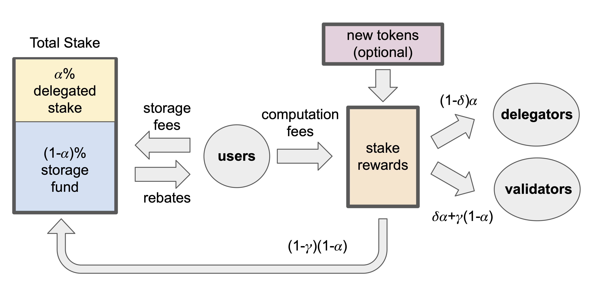

Sui의 native 토큰은 SUI이다. Sui tokenomics 구조는 Web3의 장기적인 재무 요구를 지원하도록 설계되었다. SUI 토큰은 Sui 네트워크에서 네 가지 목적을 수행한다:

1. 지분 증명 메커니즘에 참여하기 위해 SUI를 stake/staking할 기회를 제공한다.

1. SUI는 네트워크에서 transactions 또는 다른 작업을 실행하는 데 필요한 gas fees를 지불하는 데 필요한 자산 단위이다.

1. SUI는 다양한 애플리케이션을 위한 다목적이며 유동적인 자산으로 동작한다.

1. SUI 토큰은 프로토콜 업그레이드와 같은 문제에 대한 온체인 투표 참여 권리로 동작하여 governance에서 중요한 역할을 한다.

## Stakeholders

블록체인의 tokenomics에서 stakeholders는 블록체인 경제의 지속 가능성에 이해관계를 가진다. Sui 경제에는 세 가지 주요 stakeholder 그룹이 있다:

- **Users**, 네트워크에 transactions를 제출해 디지털 자산을 생성, 변경, 전송하거나 스마트 계약과 상호작용하는 사람들이다.

- **SUI 토큰 보유자**, 자신의 토큰을 validators에 stake/staking할 수 있는 선택권을 가진다. SUI owners는 Sui governance에 참여할 권리도 가진다.

- **Validators**, Sui 플랫폼에서 transaction 처리와 실행을 관리한다.

### Delegated proof of stake

Sui는 delegated proof of stake (DPoS) [consensus mechanism](/develop/sui-architecture/consensus)을 사용하며, 여기서 [validators](/operators/validator/index)는 일정량의 SUI를 담보로 [epoch](/develop/sui-architecture/epochs) 동안 잠근다. Validators는 epoch 동안 자신의 stake를 변경할 수 없으며 어떤 변경도 새로운 epoch이 시작될 때 적용된다. 그런 다음 validators는 transactions를 검증하는 것과 같은 작업을 처리하고 리소스를 제공한 대가로 rewards를 얻는다.

네트워크의 users는 자신이 보유한 SUI를 가지고 있으며 이를 validator의 stake 일부로 원하는 validators에게 위임할 수 있다. 이렇게 하면 validators는 users가 위임한 SUI 양에 따라 rewards를 지급한다. Users는 새로운 [epoch](/develop/sui-architecture/epochs)이 시작되기 전에 자유롭게 자신의 SUI를 인출하거나 다른 validator에 stake를 둘 수 있다.



## Token supply

SUI의 공급량은 유한하다. Mainnet의 SUI 토큰 총공급량은 10,000,000,000 SUI로 상한이 정해져 있다. 이는 민트될 수 있는 SUI의 총수량이지만 총공급량 전체가 transactions에 사용 가능한 것은 아니다. 공급 가능량은 네트워크의 tokenomics 안정성을 강화하고 장기적인 보안 수준을 제공하기 위해 설계된 unlocking schedules를 따른다.

## Token distribution

각 epoch 시작 시 세 가지 중요한 이벤트가 발생한다:

1. SUI holders가 자신의 토큰을 validators에게 stake/staking하고 새로운 [committee](/develop/sui-architecture/consensus)가 형성된다.

- 참조 가스 가격은 [가스 수수료](/develop/transaction-payment/gas-in-sui)에 설명된 대로 설정된다.

- [storage fund](#storage-fund) 규모는 이전 epoch의 순유입을 사용해 조정된다.

이 작업들이 끝나면 프로토콜은 total amount of stake를 staked SUI와 storage fund의 합으로 계산한다.

각 epoch 동안 users는 Sui 플랫폼에 transactions를 제출하고 validators는 이를 처리한다. 각 transaction에 대해 users는 관련 computation 및 storage gas fees를 지불한다. Users가 이전 transaction 데이터를 삭제하는 경우에는 users가 [storage fees의 일부 리베이트](#storage-fund-rewards)를 받는다. Validators는 다른 validators의 동작을 관찰하고 서로의 성능을 평가한다.

각 epoch 끝에서 프로토콜은 stake rewards를 참여자에게 분배한다. 이는 두 가지 주요 단계로 이루어진다:

1. total amount of stake rewards는 epoch 전체에 걸쳐 누적된 computation fees와 해당 epoch의 stake reward subsidies의 합으로 계산된다. 후자의 구성 요소는 네트워크 초기 몇 년에만 존재하고 유통 중인 SUI 양이 총공급량에 도달하면서 장기적으로 사라진다는 점에서 일시적이다.

1. total amount of stake rewards는 여러 엔티티에 분배된다. storage fund는 epoch total stake 계산에 고려되지만 staked SUI처럼 어떤 엔티티가 소유하는 것은 아니다. 대신 Sui 경제 모델은 storage fund에 누적되는 stake rewards를 storage costs 보상을 위해 validators에게 분배한다.

Sui tokenomics에 내장된 분배 메커니즘은 validators가 실행 가능한 비즈니스 모델로 운영하면서 낮은 gas fees를 설정하도록 유도해 공정한 가격을 위한 건전한 경쟁을 촉진한다. 이 구조를 뒷받침하는 수학적 증명에 대한 심층 검토는 [whitepaper](https://docs.sui.io/paper/tokenomics.pdf)를 참조하라.

### Vesting schedules

Vesting schedule은 특정 SUI 묶음이 언제 시장에 접근 가능해지는지를 결정한다. Sui tokenomics 설계에는 다단계 SUI vesting schedule이 포함된다.

Sui가 Mainnet 네트워크를 처음 출시했을 때(initial SUI mint)에는 1년의 cliff 기간이 있었다. 이 기간 동안 모든 초기 투자자는 자신의 초기 SUI 지분을 시장으로 이전하는 것이 차단되었다. 새로운 암호화폐에서 흔한 관행인 cliff 기간은 초기 투자자의 대규모 매도로부터 초기 네트워크 안정성을 보호했다. cliff 기간은 2024년 5월에 종료되었다.

### Airdrops

새 토큰이 출시될 때 minters가 관련 블록체인 프로젝트에 대한 관심을 유도하기 위해 초기 adopters에게 분배할 목적으로 총량의 일정 비율을 따로 두는 경우가 많다. 이 과정을 _airdrop_이라고 한다.

Sui Mainnet 네트워크 출시는 지원하기 위한 SUI 에어드롭이 없었다. 이는 다음과 같은 이유로 공개적으로 밝힌 의도적인 결정이었다: 

1. 에어드롭은 악의적인 행위자가 새로운 출시를 둘러싼 기대감을 악용할 가능성을 노출한다. Sui는 에어드롭이 없을 것이라고 공개적으로 밝힘으로써 users가 직면하는 위험을 완화하려 했다.

1. 암호화폐는 전 세계에서 서로 다르게 규제된다. 에어드롭은 일부 관할 구역에서 과세 이벤트로 간주될 수 있어 법적 또는 재무적 복잡성을 만들 수 있다.

1. Sui는 네트워크와 stakeholders의 장기적인 성공에 전념한다. 에어드롭은 프로젝트 수명 주기의 초기에 기대감을 만들 수 있지만 장기적인 이점은 미미하다.

## Storage fund

SUI는 네트워크의 gas fees와 데이터 저장 비용을 지불한다. 그러나 새 validators가 온체인에 들어올 때 잠재적 문제가 발생한다. Validator가 새롭더라도 네트워크에 참여하기 전에 발생한 활동에 대한 storage cost를 여전히 지불해야 하기 때문이다.

Sui는 완전히 고갈되지 않는 SUI 캐시인 storage fund로 이 문제를 해결한다. 체인에 데이터를 추가하는 각 온체인 transaction에는 storage를 위한 수수료가 포함되며 프로토콜은 이를 storage fund에 추가한다. storage fund 자체도 네트워크에 stake를 가지므로 다른 모든 온체인 stakeholder와 마찬가지로 해당 stake에 따른 rewards를 수집한다. 그런 다음 프로토콜은 storage 비용을 지불하기 위해 이러한 storage fund rewards를 Sui validators에게 정기적으로 분배한다. 이런 방식으로 네트워크에 새로 들어온 validators도 과거 transactions의 데이터를 저장한 대가를 받는다.

### Storage fund rewards

Total stake는 user stake와 storage fund에 예치된 SUI 토큰의 합으로 계산된다. storage fund는 total stake에 대한 상대적 규모에 따라 전체 stake rewards 중 비례 지분을 받는다. 이러한 stake rewards의 가장 큰 부분은 storage costs를 보상하기 위해 현재 validators에게 지급된다. 남는 rewards는 fund에 재투자된다. 온체인 storage 요구가 높을 때 validators는 storage costs를 보상하기 위한 상당한 추가 rewards를 받는다.

storage fund에는 세 가지 핵심 기능이 있다:

1. 과거 transactions는 storage fund에 기여하며 이는 서로 다른 epochs 사이에 gas fees를 이동시키는 도구로 동작한다. 이는 향후 validators가 처음에 그러한 storage 요구를 만든 과거 users에 의해 storage costs를 보상받도록 보장한다.

1. storage fund는 원금이 아니라 자본 수익만 지급한다. 실제로 이것은 validators가 storage fund의 SUI를 추가 stake로 빌리고 대부분의 stake rewards를 유지한다는 뜻이다. 그러나 validators가 storage fund에서 직접 자금을 받는 것은 아니다. 이는 fund가 자본을 절대 잃지 않고 무기한 생존할 수 있음을 보장한다. 이 기능은 fund에 재투자되는 stake rewards로 더욱 강화된다.

1. storage fund에는 삭제 옵션이 있다. 데이터를 삭제하면 처음에 지불한 storage fees의 일부를 환불받는다.

### Deflation

전통적인 경제학과 달리 디플레이션은 Sui에서 버그가 아니라 기능이다. SUI의 총공급량은 상한이 정해져 있으므로 네트워크 활동이 증가하면 저장된 데이터 양에 비해 storage fund가 커지면서 더 많은 SUI가 사실상 유통에서 빠져나가 디플레이션 효과가 발생한다. 유통 공급량 감소에 따라 SUI의 가치는 증가한다.

## Validator rewards

Sui의 모든 정직한 validators는 staking rewards를 완전한 확실성으로 받는다. rewards는 validators가 보유한 stake 양에만 기반하므로 랜덤성이 제거된다. 

### Staking

<a href="/references/framework/sui_sui_system/staking_pool#sui_system_staking_pool_request_add_stake" data-noBrokenLinkCheck='true'>staking function</a>을 호출하는 transaction을 network에 전송하여 SUI token을 stake한다. 이 function은 <a href="/references/framework/sui_sui_system/staking_pool" data-noBrokenLinkCheck='true'>system Move package</a>의 일부로 구현되어 있다. 이 transaction은 SUI token을 self-custodial stake [object](/develop/sui-architecture/object-model)로 wrap한다. 이 stake object에는 validator staking pool ID와 stake의 activation [epoch](/develop/sui-architecture/epochs)을 포함한 정보가 들어 있다. [SIP-6](https://blog.sui.io/liquid-staking-coming-sui/) 도입 이후에는 staked object를 사용해 liquid staking protocol에 참여할 수 있다.

[Sui-compatible crypto wallets](https://slush.app/)에는 일반적으로 Sui address에서 staking과 unstaking을 시작할 수 있는 기능이 있다. SUI staking을 시작하려면 해당 도구의 문서를 참조한다.

### Unstaking

staking과 유사하게, 사용자는 <a href="/references/framework/sui_sui_system/staking_pool#sui_system_staking_pool_request_withdraw_stake" data-noBrokenLinkCheck='true'>unstaking function</a>을 호출하는 transaction을 <a href="/references/framework/sui_sui_system/staking_pool" data-noBrokenLinkCheck='true'>system Move package</a>에 전송하여 validator로부터 stake를 인출한다. 이 transaction은 stake object를 unwrap하고 원금과 누적 rewards를 모두 SUI token으로 사용자에게 보낸다. stake가 전체 epoch 동안 active였던 epoch에서만 rewards가 누적된다. validator의 rewards pool에서 인출되는 rewards는 stake의 activation epoch과 unstaking epoch을 기준으로 계산된다.

### Choosing a validator for staking

SUI를 stake할 특정 validator를 선택해야 한다. validator 선택은 사용자가 받는 staking rewards 양에 영향을 줄 수 있다. 이 양을 결정하는 요인에는 다음이 포함되며 이에 국한되지 않는다:

- **Validator commission rate**: validator는 staker에게서 가져가는 staking rewards 비율을 지정하는 0이 아닌 commission rate를 설정할 수 있다. 예를 들어 validator의 commission rate가 10%이면 각 staker의 staking rewards 중 10%가 validator에게 주어진다.

:::caution

validator는 사전 고지 없이 미래의 어느 시점에 자신의 commission을 선택할 수 있다.

:::

- **Validator performance**: 성능이 좋지 않은 validator는 [tallying rule](/develop/transaction-payment/gas-in-sui#tallying-rule)에 따라 처벌될 수 있다. 처벌된 validator는 처벌된 epoch 동안 어떤 staking rewards도 받지 못하며, 사용자가 그 validator로부터 stake를 인출할 때 해당 epoch의 rewards도 받지 못한다.

Sui-compatible crypto wallets와 [explorers](https://suiscan.xyz/mainnet/home)는 일반적으로 commission과 APY 같은 validator 정보를 제공한다. 이 데이터를 조회하는 방법은 해당 도구의 문서를 참조한다.

### Staking pools

각 Sui validator는 stake 양을 추적하고 staking rewards를 복리로 누적하기 위해 자체 staking pool을 유지한다. Validator pools는 각 epoch 경계에서 계산되는 환율 시계열과 함께 동작한다. 이 환율은 과거의 각 SUI staker가 미래에 인출할 수 있는 SUI 토큰의 양을 결정한다. 중요한 점은 staking pool에 더 많은 rewards가 예치될수록 환율이 증가한다는 것이다. SUI가 staking pool에 예치된 시간이 길수록 더 많은 rewards가 누적된다.

SUI가 epoch `E`에 staking pool에 예치되면 해당 SUI는 epoch `E` 환율에 따라 유동성 토큰으로 변환된다. staking pool이 rewards를 얻으면 환율이 상승한다. epoch `E'`에서 해당 유동성 토큰의 가치는 더 커지고 더 많은 SUI로 환산된다.

Sui staking pools와 일반적인 liquidity pools의 유일한 차이는 Sui에서는 유동성 토큰이 존재하지 않는다는 점이다. 대신 전역 환율 테이블이 회계를 추적하는 데 사용된다. staking pool의 모든 SUI 토큰은 동일하게 취급되므로 모든 SUI 토큰이 즉시 stake로 계산되고 따라서 rewards도 즉시 복리로 누적된다.

staking pool은 시스템 수준 스마트 계약([`staking_pool.move`](https://github.com/MystenLabs/sui/blob/main/crates/sui-framework/packages/sui-system/sources/staking_pool.move))으로 구현되며 Sui framework의 일부이다.

### Validator pool exchange rate 

각 validator pool의 환율은 각 epoch 경계에서 다음과 같이 계산된다:
$$
Exchange rate at E+1 = (1 + (third-party staker rewards at E / third-party stake at E)) × (exchange rate at E)
$$

제3자 소유 rewards 및 stake와 validator 소유 rewards 및 stake의 구분은 validators는 staking pool의 토큰에 대해 commission을 얻지만 제3자 stakers는 그렇지 않다는 점에서 중요하다. 이 회계 방식은 Sui가 하나의 전역 환율 테이블을 사용하여 validators와 제3자 토큰 보유자 모두에게 누적된 rewards를 추적할 수 있게 한다.

<ImportContent source="staking-pool-reqs" mode="snippet" />

#### Understanding the voting power formula

[SIP-39](https://github.com/sui-foundation/sips/pull/39)은 validator가 세트에 참여할 수 있는지 결정하기 위해 다음 공식을 사용한다:

```
S / (S + T) > V / 10000
```

- `S` = validator 후보의 stake 양.

- `T` = 네트워크에 이미 stake된 총량.

- `V` = 최소 voting power 임곗값(최종 단계에서는 3).

- `10000` = Sui 시스템의 총 voting power 단위.

이 공식은 validator가 참여 후 최소 `V`의 voting power를 갖게 되는지를 확인한다. 

1. `S / (S + T)`는 validator가 전체 stake 중 어느 비율을 제어할지를 계산한다.

1. 여기에 `10000`을 곱하면 Sui의 표준화된 단위에서 voting power가 된다.

1. 이 값이 임곗값 `V`보다 크거나 같으면 validator는 참여할 수 있다.

예를 들어 네트워크 stake가 7.69B SUI이고 `V`=3일 때 2.31M SUI를 가진 validator는 다음 값을 가진다: 2,310,000 / (2,310,000 + 7,694,950,773) ≈ 0.0003 비율이며 이를 voting power로 환산하면 0.0003 × 10000 ≈ 3 단위이다.

3 ≥ 3이므로 참여 임곗값을 충족한다.

전체 네트워크 stake가 변하면 필요한 최소 금액도 자동으로 조정된다.
