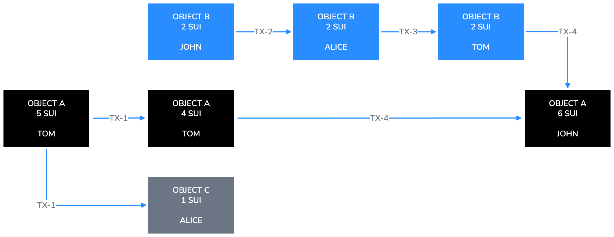

Sui의 모든 업데이트는 네트워크 자체에 관한 것이든 네트워크 위 객체에 관한 것이든 트랜잭션으로 발생한다.
트랜잭션은 객체 생성과 자산 민트부터 네트워크 작업 관리에 이르기까지 모든 것을 처리한다.

Sui에는 두 가지 유형의 트랜잭션이 있다:

- **[프로그래머블 트랜잭션 블록 (PTB)](/develop/transactions/ptbs/prog-txn-blocks):** 스마트 계약 배포와 토큰 전송 같은 일상적인 네트워크 활동을 가능하게 한다. 누구나 PTB를 생성하고 제출할 수 있다.

- **시스템 트랜잭션:** 에포크 변경과 체크포인트 생성 같은 네트워크 이벤트를 관리한다. 오직 validator만 시스템 트랜잭션을 제출할 수 있다.

## 트랜잭션 메타데이터

프로그래머블 트랜잭션 블록에는 다음 메타데이터 필드가 있다:

- **송신자 주소:** 트랜잭션을 보내는 사용자의 [주소](/getting-started/onboarding/get-address)이다.

- **가스 입력:** 트랜잭션 실행과 저장 비용을 지불하는 데 사용하는 객체를 가리키는 참조이다. 송신자 주소는 이 객체를 소유해야 하며 이 객체의 타입은 `sui::coin::Coin<SUI>`여야 한다. 또는 가스 지불이 빈 목록일 수 있으며, 이 경우 트랜잭션은 송신자의 주소 잔액에서 가스를 지불한다.

- **가스 가격:** 트랜잭션이 가스 단위당 지불하는 네이티브 토큰 수를 지정하는 부호 없는 정수이다. 가스 가격은 0보다 커야 한다.

- **최대 가스 예산:** 트랜잭션이 사용할 수 있는 가스 단위의 최대 수이다. 실행이 이 예산을 초과하면 트랜잭션은 가스 입력 객체에 비용을 청구하는 것 외에는 아무 effect 없이 abort된다. 가스 입력 객체의 잔액은 가스 가격과 최대 가스 예산을 곱한 값보다 크거나 같아야 한다. 이 곱은 트랜잭션이 청구할 수 있는 최대 금액을 나타낸다.

- **에포크:** 트랜잭션이 대상으로 하는 에포크이다.

- **Type:** 트랜잭션이 call, publish, native 트랜잭션 중 무엇인지와 해당 타입별 데이터를 식별한다.

- **Authenticator:** 공개 키와 쌍을 이루는 암호학적 서명이다. 공개 키는 서명을 검증할 수 있어야 하며 송신자 주소와 일치해야 한다.

- **Expiration:** 선택 사항이다. 마감 시점 역할을 하는 에포크 번호이다. validator는 현재 에포크가 expiration 에포크보다 작거나 같을 때만 트랜잭션을 수락한다. 마감 시점이 지나면 트랜잭션은 실행되지 않는다. 기본적으로 트랜잭션은 만료되지 않는다. 주소 잔액 기반 가스 지불을 사용하는 트랜잭션은 최소 에포크와 최대 에포크를 모두 지정한 `ValidDuring` expiration을 사용해야 한다.

시스템 트랜잭션에는 가스 입력, 가격, 예산이 없고 expiration도 없다.
시스템 트랜잭션의 송신자 주소는 항상 `0x0`이다.

## 트랜잭션 흐름 예시

객체와 트랜잭션의 관계는 [directed acyclic graph](https://en.wikipedia.org/wiki/Directed_acyclic_graph)(DAG)에 기록된다.
다음 예시는 Sui에서 객체와 트랜잭션이 서로 어떻게 연결되는지를 보여준다.

두 개의 객체를 생각해 보자:

- Object A에는 5 SUI 코인이 들어 있고 Tom의 것이다.

- Object B에는 2 SUI 코인이 들어 있고 John의 것이다.

Tom은 Alice에게 1 SUI 코인을 보내기로 결정한다.
이 경우 Object A가 이 트랜잭션의 입력이며 이 객체에서 1 SUI 코인이 차감된다.
이 트랜잭션의 출력은 다음과 같다:

- 여전히 Tom의 것이며 4 SUI 코인을 가진 Object A.
- 1 SUI 코인을 담고 Alice의 것이 된 새 Object C.

동시에 John은 Alice에게 2 SUI 코인을 보내기로 결정한다.
이 트랜잭션의 출력은 다음과 같다:

- 이제 Alice의 것이 된 2 SUI 코인이 담긴 Object B.

두 트랜잭션이 서로 다른 객체와 상호작용하므로 두 번째 트랜잭션은 Tom이 Alice에게 코인을 보내는 첫 번째 트랜잭션과 병렬로 실행된다.

2 SUI 코인을 받은 뒤 Alice는 그것을 Tom에게 보낸다.
이제 Tom은 Object A에서 온 4와 Object B에서 온 2를 합쳐 6 SUI 코인을 가지게 된다.

마지막으로 Tom은 자신이 가진 모든 SUI 코인을 John에게 보낸다.
이 트랜잭션에서는 Object A와 Object B가 모두 입력이다.
Object B는 파기되고 그 값이 Object A에 더해진다.
그 결과 이 트랜잭션의 출력은 값이 6 SUI인 Object A 하나뿐이다.

## 트랜잭션, 객체, 데이터 제한

Sui에는 트랜잭션과 그에 사용되는 데이터에 대해 최대 크기와 사용 가능한 객체 수 같은 몇 가지 제한이 있다.
이 제한은 Sui repo의 [`sui-protocol-config` crate](https://github.com/MystenLabs/sui/blob/main/crates/sui-protocol-config/src/lib.rs)에서 찾을 수 있다.
제한은 `ProtocolConfig` struct와 `get_for_version_impl` 함수에 설정된 값으로 정의되어 있다.
