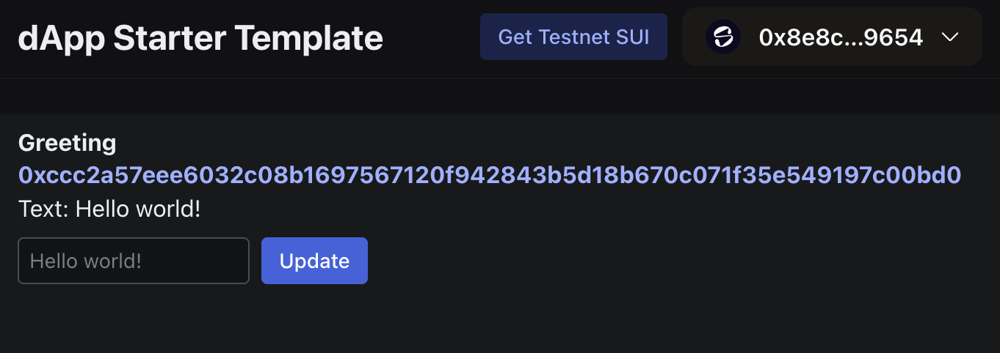
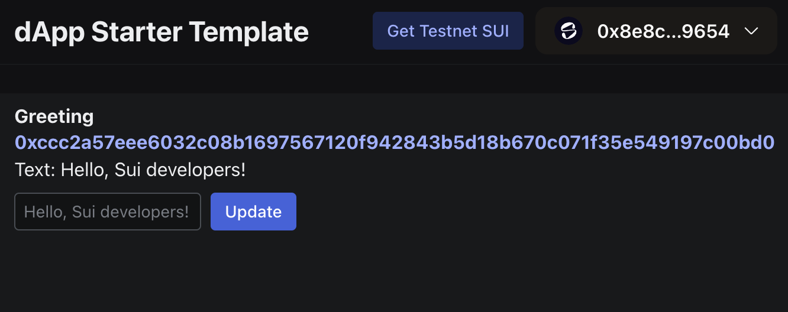

이전 가이드인 ["Hello, World!"](/getting-started/onboarding/hello-world)에서 Move 패키지를 배포하고 이와 상호작용하여 text "Hello world!"를 저장하는 객체를 생성했다.

이 가이드는 React 인터페이스를 그 "Hello, World!" 패키지에 연결해 모든 사용자가 브라우저에서 Move 패키지와 상호작용하고 사용자 지정 greeting을 설정할 수 있는 방법을 보여 준다.

<Tabs className="tabsHeadingCentered--small">
<TabItem value="prereq" label="사전 요구 사항">

- [x] [최신 버전의 Sui를 설치한다](/getting-started/onboarding/sui-install).

- [x] [Sui 클라이언트를 설정한다](/getting-started/onboarding/configure-sui-client).

- [x] [Sui 주소를 생성한다](/getting-started/onboarding/get-address).

- [x] [SUI Testnet 토큰을 받는다](/getting-started/onboarding/get-coins).

- [x] ["Hello, World!"](/getting-started/onboarding/hello-world) 가이드를 완료하고 게시한 Move 패키지의 ID를 가지고 있어야 한다.

- [x] 패키지 관리자로 사용할 [`pnpm`](https://pnpm.io/installation)을 설치한다.

- [x] [Slush](https://slush.app/) 지갑을 만든다.

</TabItem>
</Tabs>

## Move 패키지 호출

먼저 ["Hello, World!" 예제 가이드](https://github.com/MystenLabs/sui-stack-hello-world.git)를 완료했고 CLI에서 `sui-stack-hello-world/move/hello-world` 디렉터리 안에 있는지 확인한다.

그다음 객체 정보를 조회해 Move 패키지가 여전히 Testnet에서 사용 가능한지 확인한다:

```
$ sui client object <PACKAGE_ID>
```

`<PACKAGE_ID>`를 Move 패키지의 ID로 바꾼다.

:::danger

패키지가 더 이상 존재하지 않거나 패키지 ID를 다시 얻어야 한다면 ["Hello, World!"](https://github.com/MystenLabs/sui-stack-hello-world.git) 가이드의 단계를 따른다.

:::

## 프런트엔드 소스 코드 보기

"Hello, World!" 예시 프로젝트에서 `sui-stack-hello-world/ui` 하위 디렉터리에는 프런트엔드 인터페이스 소스 코드 파일이 들어 있다:

```
.
├── eslint.config.js
├── index.html
├── package.json
├── pnpm-lock.yaml
├── prettier.config.cjs
├── src
│   ├── App.tsx
│   ├── constants.ts
│   ├── CreateGreeting.tsx
│   ├── dapp-kit.ts
│   ├── Greeting.tsx
│   ├── main.tsx
│   ├── networkConfig.ts
│   └── vite-env.d.ts
├── tsconfig.json
├── tsconfig.node.json
└── vite.config.mts
```

### `App.tsx`

`App.tsx` 파일에는 React 앱을 위한 기본 스타터 템플릿을 만드는 코드가 들어 있다.

이 파일에는 앱에 Slush 지갑을 연결하는 버튼과 Testnet SUI를 받기 위해 Sui Faucet을 여는 버튼이 포함되어 있다.

<ImportContent source="/ui/src/App.tsx" mode="code" org="MystenLabs" repo="sui-stack-hello-world" />

### `CreateGreeting.tsx`

`CreateGreeting.tsx` 파일에는 Move 패키지에 트랜잭션을 만들고 전송하는 로직이 들어 있다.

이 트랜잭션은 패키지의 `new` 함수를 호출하고, 이 함수는 값 `Hello world!`를 가진 Move 객체를 생성한다.

["Hello, World!"](/getting-started/onboarding/hello-world) 가이드에서는 이 함수를 `sui client call --package <PACKAGE_ID> --module greeting --function new` 명령으로 CLI에서 수동 호출했다.

<ImportContent source="/ui/src/CreateGreeting.tsx" mode="code" org="MystenLabs" repo="sui-stack-hello-world" />

### `Greeting.tsx`

`Greeting.tsx` 파일에도 Move 패키지에 트랜잭션을 만들고 전송하는 로직이 들어 있다.

하지만 이 트랜잭션은 패키지의 `update_text` 함수를 호출하며, 이 함수는 text를 수정해 "Hello world!"를 사용자가 선택한 text로 바꾼다.

<ImportContent source="/ui/src/Greeting.tsx" mode="code" org="MystenLabs" repo="sui-stack-hello-world" />

## React 인터페이스를 Move 패키지에 연결

`constants.ts` 파일은 React 앱을 Move 패키지에 연결하는 위치이다.

이 파일에는 Move 패키지 ID를 상수 `TESTNET_HELLO_WORLD_PACKAGE_ID`로 설정하는 한 줄이 들어 있다.

기본적으로 이 파일에는 예시 패키지 ID가 들어 있다.

이 파일을 수정해 대신 자신의 Move 패키지 ID를 넣는다.

<ImportContent source="/ui/src/constants.ts" mode="code" org="MystenLabs" repo="sui-stack-hello-world" />

이 상수는 `networkConfig.ts` 파일에서 사용된다:

<ImportContent source="/ui/src/networkConfig.ts" mode="code" org="MystenLabs" repo="sui-stack-hello-world" />

## 프런트엔드 의존성 설치

이제 아직 해당 위치에 있지 않다면 `sui-stack-hello-world/ui` 디렉터리로 이동하고 필요한 프런트엔드 의존성을 설치한다:

```sh
$ pnpm install
```

## React 애플리케이션 실행

로컬 개발 환경에서 React 애플리케이션을 시작한다:

```sh
$ pnpm dev
```

그다음 브라우저에서 `http://localhost:5173/`를 연다.

앱이 Slush 지갑 연결을 요청한다.

**Connect Wallet**을 클릭하고 프롬프트가 표시되면 인증한 다음 연결을 승인한다.

## Slush 지갑으로 SUI 토큰 전송

이전 가이드에서 CLI에서 사용한 주소로 SUI 토큰을 보낸 뒤 브라우저에서 새 Slush 지갑을 만들었다면, Slush 지갑으로 SUI 토큰을 보내야 할 가능성이 크다.

Slush 지갑 주소는 CLI에서 생성하고 사용한 주소와 다르고 별개이다.

[Testnet SUI](/getting-started/onboarding/get-coins) 지침을 따라 Testnet 토큰을 Slush 주소로 전송한다.

## 프런트엔드 인터페이스 사용

다음으로 **Create Greeting** 버튼을 클릭한다.

코드에서 이 버튼은 `CreateGreeting.ts`에 저장된 로직을 활성화해 Move 패키지로 트랜잭션을 전송하고, 이 트랜잭션이 `new` 함수를 호출하여 `Greeting` 객체를 생성한다.

Slush 지갑이 이 트랜잭션의 승인을 요청한다.

:::danger

문제가 있으면 트랜잭션 승인 프롬프트에 오류 메시지가 표시된다.

흔한 오류에는 gas 코인이 부족하거나 Move 패키지 ID가 올바르지 않아 발생하는 "Unable to Process Transaction"이 포함된다.

이 오류를 해결하려면 [Testnet SUI를 받거나](/getting-started/onboarding/get-coins) [올바른 Move 패키지 ID가 있는지 확인한다](/getting-started/onboarding/hello-world).

:::

트랜잭션을 승인하면 브라우저 창에 `Greeting` 객체의 ID와 내용이 표시되며, 기본값은 "Hello world!"이다.

이 text를 바꾸려면 기본값 아래 텍스트 상자에 다른 greeting을 입력하고 **Update**를 클릭한다.

Slush 지갑이 트랜잭션 승인을 요청한다.



트랜잭션을 승인한 후 새 greeting이 표시된다:



<div className="next-steps-module">
  <div className="next-steps-header">
    <h3>다음 단계</h3>
  </div>
  <div className="next-steps-grid">
    <Card className="plausible-event-name=hello+data+button"
      title="Sui 데이터 접근"
      href="/develop/accessing-data/data-serving"
    >
      Sui에서 데이터에 접근하는 방법을 더 알아본다.
    </Card>
    <Card className="plausible-event-name=hello+community+button"
      title="커뮤니티 참여"
      href="/getting-started/onboarding/next-steps"
    >
      Sui 개발자 커뮤니티에 참여하고, 다른 예시 프로젝트를 시도하거나, 더 많은 문서를 읽는다.
    </Card>
  </div>
</div>
