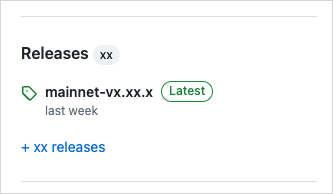

<ImportContent source="info-easy-install" mode="snippet" />

각 Sui 릴리스는 여러 운영 체제를 위한 binary 집합을 제공한다.

이 binary를 GitHub에서 다운로드해 Sui를 설치할 수 있다.

<Tabs groupId="operating-systems">

<TabItem value="linux" label="Linux">

1. https://github.com/MystenLabs/sui 로 이동한다.
1. 오른쪽 패널에서 **Releases** 섹션을 찾는다.

    
1. **Latest** 태그가 붙은 릴리스를 클릭해 해당 릴리스 페이지를 연다.
1. 릴리스의 **Assets** 섹션에서 운영 체제에 맞는 `.tgz` 압축 파일을 선택한다.
1. `.tgz` 파일의 모든 파일을 시스템의 원하는 위치에 압축 해제한다. 이 지침은 설명을 위해 시스템 사용자 루트의 `sui` 폴더에 파일을 추출한다고 가정한다. 다른 디렉터리를 선택했다면 이후 단계에서 이 위치에 대한 참조를 바꾼다.
1. 압축을 푼 폴더로 이동한다. 다음과 같이 추출된 파일이 있어야 한다:

    <ImportContent source="lists/binaries-file-list" mode="snippet" />

1. 추출된 파일이 들어 있는 폴더를 `PATH` 변수에 추가한다. 이를 위해 `~/.bashrc`를 업데이트하여 Sui binary 위치를 포함시킬 수 있다. 권장 위치를 사용한다면 `export PATH=$PATH:~/sui`를 입력하고 Enter를 누른다.
1. 새 터미널 세션을 시작하거나 `source ~/.bashrc`를 입력하여 새 `PATH` 값을 로드한다.

</TabItem>

<TabItem value="mac" label="macOS">

1. https://github.com/MystenLabs/sui 로 이동한다.
1. 오른쪽 패널에서 **Releases** 섹션을 찾는다.

    
1. **Latest** 태그가 붙은 릴리스를 클릭해 해당 릴리스 페이지를 연다.
1. 릴리스의 **Assets** 섹션에서 운영 체제에 맞는 `.tgz` 압축 파일을 선택한다.
1. `.tgz` 파일의 모든 파일을 시스템의 원하는 위치에 압축 해제한다. 이 지침은 파일을 시스템 사용자 루트의 `sui` 폴더에 추출한다고 가정한다. 다른 디렉터리를 선택했다면 이후 단계에서 이 위치에 대한 참조를 바꾼다.
1. 압축을 푼 폴더로 이동한다. 다음과 같이 추출된 파일이 있어야 한다:

    <ImportContent source="lists/binaries-file-list" mode="snippet" />

1. 추출된 파일이 들어 있는 폴더를 `PATH` 변수에 추가한다. 이를 위해 `~/.zshrc` 또는 `~/.bashrc`를 업데이트하여 Sui binary 위치를 포함시킬 수 있다. 권장 위치를 사용한다면 `export PATH=$PATH:~/sui`를 입력하고 Enter를 누른다.
1. 새 console 세션을 시작하거나 `source ~/.zshrc` (또는 `.bashrc`)를 입력하여 새 `PATH` 값을 로드한다.
1. 처음 binary를 실행하는 경우 MacOS에서 binary 실행을 막는 오류를 받을 수 있다. 이 오류를 받으면 dialog를 닫고 console에 `xattr -d com.apple.quarantine ~/sui/*`를 입력한 뒤 <kbd>Enter</kbd>를 누른다(경로가 다르면 반드시 조정한다).

</TabItem>

<TabItem value="win" label="Windows">

1. https://github.com/MystenLabs/sui 로 이동한다.
1. 오른쪽 패널에서 **Releases** 섹션을 찾는다.

    
1. **Latest** 태그가 붙은 릴리스를 클릭해 해당 릴리스 페이지를 연다.
1. 릴리스의 **Assets** 섹션에서 운영 체제에 맞는 `.tgz` 압축 파일을 선택한다.
1. `.tgz` 파일의 모든 파일을 시스템의 원하는 위치에 압축 해제한다. 이 지침은 설명을 위해 C 드라이브 루트의 `sui` 폴더에 파일을 추출한다고 가정한다. 다른 디렉터리를 선택했다면 이후 단계에서 이 위치에 대한 참조를 바꾼다.

    :::info

    Windows는 `.tgz` 파일을 기본으로 지원하지 않지만 [7Zip](https://7-zip.org/) 같은 무료 압축 파일 앱을 사용해 압축을 풀 수 있다.

    :::

1. 압축을 푼 폴더로 이동한다. 다음과 같이 추출된 파일이 있어야 한다:

    <ImportContent source="lists/binaries-file-list" mode="snippet" />

1. 추출된 파일이 들어 있는 폴더를 `PATH` 변수에 추가한다. Windows version에 따라 설정 창으로 가는 방법은 여러 가지가 있다. 모든 Windows version에서 동작하는 한 방법은 console에 `sysdm.cpl`을 입력해 System Properties 창을 여는 것이다. **Advanced** 탭에서 **Environment Variables...** 버튼을 클릭한다.
1. Environment Variables 창에서 `Path` 변수를 선택하고 **Edit...** 버튼을 클릭한다.
1. Edit environment variable 창에서 **New**를 클릭하고 압축을 푼 폴더 경로를 추가한다. 예시 경로를 사용한다면 `C:\sui`가 된다.
1. **OK**를 클릭한다.

</TabItem>

</Tabs>

## Build binaries locally

Sui repo를 다운로드하고 binary를 로컬에서 빌드할 수 있다.

Binary는 `target/release` 디렉터리로 내보내진다.

```sh
$ cargo build --profile release --bin sui
```

필요에 따라 다른 package도 포함한다.

<ImportContent source="lists/binaries-file-list" mode="snippet" />

## Upgrade from Cargo

이전에 Sui binary를 설치했다면 설치에 사용했던 것과 같은 명령으로 가장 최신 릴리스로 업데이트할 수 있다(`testnet`은 원하는 branch로 변경한다):

```sh
$ cargo install --locked --git https://github.com/MystenLabs/sui.git --branch testnet sui --features tracing
```

:::info

`tracing` feature는 Sui CLI에서 Move test coverage와 debugger 지원을 활성화한다.

`tracing`을 활성화하지 않으면 이 기능을 사용할 수 없다.

:::

## Install `sui-node` for Ubuntu from AWS {#aws-sui-node}

<ImportContent source="install-sui-node" mode="snippet" />
