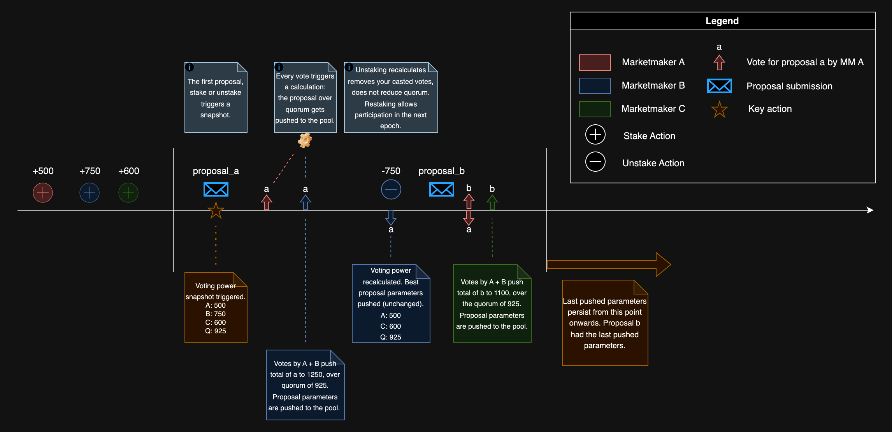

DeepBook의 새로운 거버넌스 접근 방식은 사용자가 단일 pool의 세 가지 파라미터를 업데이트할 수 있도록 한다:

- Taker fee rate
- Maker fee rate
- Stake required

Stake required는 사용자가 taker 및 maker 인센티브를 활용하기 위해 pool에 stake해 두어야 하는 DEEP 토큰의 amount이다. 각 DeepBook pool은 독립적인 거버넌스를 가지며, 거버넌스는 매 epoch마다 수행될 수 있다. 거버넌스에 대해 더 알아보려면 [설계](../design#governance)을 참조한다.

## API

`Pool`은 staking과 거버넌스를 위한 다음 엔드포인트를 노출한다.

Stake

staking을 위해 `balance_manager`에서 DEEP 토큰을 사용할 수 있어야 한다. 사용자의 stake는 다음 epoch에서 활성화된다. 사용자의 활성 stake가 stake required보다 크면 사용자는 reduced taker fees를 받을 수 있고 해당 epoch 동안 trading fee rebates를 누적할 수 있다.

<ImportContent source="packages/deepbook/sources/pool.move" mode="code" org="MystenLabs" repo="deepbookv3" fun="stake" noComments />

Unstake

사용자의 활성 stake와 비활성 stake는 모두 제거되어 `BalanceManager`로 다시 추가된다. casted votes는 모두 제거된다. epoch에 대한 maker rebates는 forfeited되며, 남은 epoch에 대한 reduced taker fees는 disabled된다.

`balance_manager`는 충분한 staked DEEP 토큰을 보유해야 한다. `balance_manager` data는 unstaked amount로 업데이트된다. balance는 즉시 `balance_manager`로 이체된다.

<ImportContent source="packages/deepbook/sources/pool.move" mode="code" org="MystenLabs" repo="deepbookv3" fun="unstake" noComments />

Submit proposal

0이 아닌 active stake를 가진 사용자는 proposal을 제출할 수 있다. 사용자당 proposal은 하나이다. 사용자는 제출한 proposal에 자동으로 투표한다.

taker fee, maker fee, stake required를 변경하는 proposal을 제출한다. 참여하려면 `balance_manager`에 충분한 staked DEEP 토큰이 있어야 한다. 각 `balance_manager`는 epoch당 하나의 proposal만 제출할 수 있다. maximum proposal에 도달하면 가장 낮은 vote를 받은 proposal이 제거된다. `balance_manager`의 voting power가 가장 낮은 vote를 받은 proposal보다 작으면 proposal이 추가되지 않는다.

<ImportContent source="packages/deepbook/sources/pool.move" mode="code" org="MystenLabs" repo="deepbookv3" fun="submit_proposal" noComments />

Vote

0이 아닌 voting power를 가진 사용자는 proposal에 투표할 수 있다. 모든 voting power는 단일 proposal에 사용된다. 사용자가 이 epoch 동안 다른 proposal에 투표했다면 그 vote는 제거되고 new proposal로 recasted된다. 참여하려면 `balance_manager`에 충분한 staked DEEP 토큰이 있어야 한다.

<ImportContent source="packages/deepbook/sources/pool.move" mode="code" org="MystenLabs" repo="deepbookv3" fun="vote" noComments />

Claim rebates

`claim_rebates`를 사용하여 `balance_manager`에 대한 rewards를 claim한다. `balance_manager`에는 claim할 rewards가 있어야 한다. `balance_manager` data는 claimed rewards로 업데이트된다.

<ImportContent source="packages/deepbook/sources/pool.move" mode="code" org="MystenLabs" repo="deepbookv3" fun="claim_rebates" noComments />

