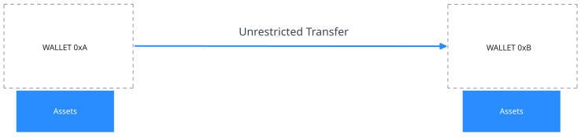
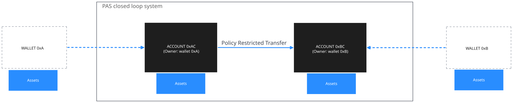
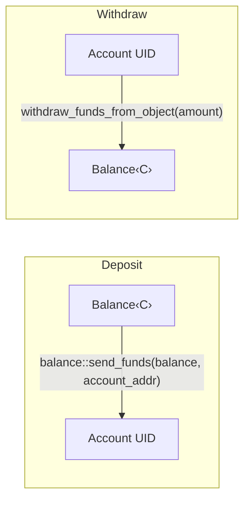

:::caution

Permissioned Asset Standard는 현재 Testnet에서 사용할 수 있다. 아직 Mainnet에는 live 상태가 아니다.

:::

Sui에서 `store` ability가 있는 object는 owner가 자유롭게 transfer할 수 있다. `Balance`와 `Coin`은 모두 `store`를 가지므로, 이를 보유하고 있다면 network 어디로든 restriction 없이 보낼 수 있다.

이는 general-purpose asset에는 적합하지만, transfer control, compliance check 또는 issuer oversight가 필요한 regulated asset에는 문제가 된다.

Permissioned Asset Standard (PAS)는 **Accounts**를 통해 asset ownership을 proxy함으로써 이를 해결한다. Accounts는 asset을 보관하고, 모든 movement가 programmable approval logic으로 gate되는 closed-loop system을 강제하는 object이다.

[TypeScript package](https://www.npmjs.com/package/@mysten/pas)를 통해 PAS를 사용할 수 있으며, [GitHub repo](https://github.com/MystenLabs/pas)에서 더 자세히 알아볼 수 있다.

## 작동 방식

PAS는 각 wallet address(또는 object ID)마다 one-to-one derived Account를 생성한다. Account는 해당 address를 대신해 asset을 보관하는 shared object이다. owner는 `Auth` proof를 통해 ownership을 증명할 수 있지만 asset을 자유롭게 transfer할 수는 없다. 이는 asset이 PAS module의 constraint와, 순차적으로 issuer가 하나 이상의 package에서 approval witness를 통해 정의한 rule을 따르는 ownership proxy를 만든다.

funds가 이동할 때마다 동일 transaction 안에서 resolve되기 전에 미리 정의된 approval stamp(witness struct) set을 모아야 하는 hot potato request를 거친다. Hot potato request에는 `drop` 또는 `store` ability가 없으므로 request가 resolve되지 않으면 transaction이 abort된다.

다음 diagram은 PAS가 없는 asset ownership과 PAS를 사용하는 asset ownership을 비교한다.

**PAS 없음**



**PAS 사용**



각 asset type은 action별 approve에 필요한 witness를 정의하는 자체 policy를 가질 수 있다. 즉 서로 다른 asset은 완전히 다른 rule을 따를 수 있다. 어떤 asset은 단일 compliance stamp만 필요할 수 있고, 다른 asset은 여러 independent contract의 approval이 필요할 수 있다.

결과적으로 asset은 issuer가 policy level에서 정의한 programmable, composable approval logic으로 모든 movement가 gate되는 closed system 안에 보관된다.

필요한 approval을 모으는 request를 거치지 않고 managed `Balance<C>`를 system 밖으로 transfer할 방법은 없다.

currency의 경우 이는 Move type level에서 강제된다.

- `Balance<C>`는 `balance::send_funds`와 `balance::redeem_funds`를 사용해 Account 안에 저장된다(derived object storage).

- funds를 이동하는 유일한 방법은 같은 transaction 안에서 resolve되어야 하는 request hot potato를 통하는 것이다.

- resolution에는 `Policy<Balance<C>>`에 정의된 approval set과 일치하는 approval이 필요하다.

## Object model 구조

다음 diagram은 PAS object hierarchy를 보여준다.

```
Namespace (shared, singleton)
├── Account (@0xAlice)      ← derived from (namespace_id, AccountKey(alice_addr))
├── Account (@0xBob)        ← derived from (namespace_id, AccountKey(bob_addr))
├── Policy<Balance<C>>    ← derived from (namespace_id, PolicyKey<Balance<C>>)
│   └── PolicyCap<Balance<C>>  ← derived from (policy_id, PolicyCapKey)
└── Templates             ← derived from (namespace_id, TemplateKey)
```

모든 object는 derived address(`sui::derived_object`)를 사용하므로 deterministic하며 onchain lookup 없이 query할 수 있다.

### Namespace 구조

Namespace는 system의 root이다. 책임은 다음과 같다.

- Accounts, policies, templates의 address derive

- emergency version blocking을 위한 `Versioning` state 보관

- admin operation(version blocking, setup)을 gate하기 위한 `UpgradeCap` UID 유지

### Account

Account는 Namespace UID와 owner address에서 derive되는 shared object이다.

| **속성** | **상세** |
|---|---|
| **Creation** | Permissionless. 누구나 어떤 address에 대해서도 Account를 만들 수 있다. |
| **Ownership** | Wallet address(`ctx.sender()`) 또는 object(`UID`). |
| **Storage** | `Balance<C>`를 object balance로 보관하거나, `T`를 Account UID의 object로 직접 보관한다. |
| **Derivation** | `derived_object::claim(namespace_uid, AccountKey(owner))`. |

### Policy

`Policy<T>`는 managed asset type `T`에 대해 resolve 가능한 action을 정의한다.

- **Required approvals:** action type별(`send_funds`, `unlock_funds`, `clawback_funds`).

- **Clawback flag:** issuer clawback이 허용되는지 여부.

- **Versioning:** Namespace에서 sync된다. package version을 block할 수 있다.

currency의 경우 `policy::new_for_currency(&mut namespace, &mut treasury_cap, clawback_allowed)`를 통해 `Policy<Balance<C>>`를 생성한다. 여기에는 currency ownership의 proof로 `TreasuryCap<C>`가 필요하다.

### `PolicyCap`

policy를 관리하는 capability이다. policy UID와 `PolicyCapKey`에서 one-to-one으로 derive된다. 다음 작업에 사용한다.

- action별 required approval 설정 또는 업데이트

- action approval 제거(해당 action의 request를 unresolvable하게 만든다)

## request pattern

PAS의 모든 state-changing operation은 request hot potato pattern을 따른다.


1. **Create:** Account method가 data `T`를 `Request<Action<T>>`로 wrap한다. request는 empty approval set으로 시작한다.

2. **Approve:** package가 `request.approve(MyWitness())`를 호출해 type-level proof로 request에 stamp한다. 여러 package에서 여러 approval을 모을 수 있다.

3. **Resolve:** resolution function이 수집된 approval이 policy의 required approval과 정확히 일치하는지 확인하고 request object를 destroy한 뒤 action을 실행하거나 data를 unwrap한다.

### Request type

사용 가능한 request type은 다음과 같다.

- `Request<SendFunds<T>>`: account 간 transfer

- `Request<ClawbackFunds<T>>`: issuer funds withdrawal

- `Request<UnlockFunds<T>>`: funds owner로서 system에서 withdraw

### Approval matching 방식

approval은 `TypeName`을 사용해 type identity로 match된다. approval set은 policy required approval과 정확히 같아야 한다(same types, same count, `VecSet` insertion을 통한 same order).

:::info

현재 version에서는 각 action이 단일 approval witness만 지원한다. 여러 independent contract의 stamp를 요구하는 multi-approval support는 향후 release에 예정되어 있다.

:::

예를 들어 contract에 정의된 `TransferApproval` witness struct의 경우:

```move
// Policy requires: { TransferApproval }
// Request has:     { TransferApproval }  ← resolves
// Request has:     { TransferApproval, ExtraApproval }  ← aborts (count mismatch)
// Request has:     { WrongApproval }  ← aborts (type mismatch)
```

## Balance tracking 방식

PAS는 Sui [주소 잔액](/onchain-finance/asset-custody/address-balance-migration)을 사용한다.

### 잔액 저장 방식

다음 diagram은 balance가 Account에 연결되는 방식을 보여준다.

```
Account (shared object)
  └── UID
       └── Balance<MY_COIN> stored via balance::send_funds(balance, account_object_address)
```

Balance는 `Account` struct의 field로 저장되지 않는다. `balance::send_funds`를 사용해 Account object address로 funds를 보내고, `balance::withdraw_funds_from_object`(`UID.withdraw_funds_from_object`를 통해)를 사용해 다시 꺼내는 방식으로 Account UID의 object balance로 저장된다.

### Balance flow 개요

다음 diagram은 deposit 및 withdrawal path를 보여준다.



Deposit은 permissionless이다(누구나 어떤 Account에도 deposit할 수 있다). Withdrawal은 internal(`public(package)`)이다. PAS module만 withdraw할 수 있으며, request를 통해서만 가능하다.

## Wallet ownership과 object ownership 비교

Account는 wallet address 또는 object가 소유할 수 있다.

다음 예시는 두 authentication method를 보여준다.

```move
// Wallet-owned: proves ownership via transaction sender
let auth = account::new_auth(ctx);

// Object-owned: proves ownership via UID reference
let auth = account::new_auth_as_object(&mut my_object_uid);
```

## Derived object address

모든 PAS object(Accounts, policies)는 deterministic derived address를 사용한다. 이를 offchain에서 계산할 수 있다.

```move
// Get the account address for an owner
let account_addr: address = namespace.account_address(@0xAlice);

// Get the policy address for a type
let policy_addr: address = namespace.policy_address<Balance<MY_COIN>>();
```

## Security model 개요

PAS는 다음을 보장한다.

- **Closed loop:** Managed asset은 matching approval이 있는 request를 거치지 않고 system을 떠날 수 없다.

- **Type-safe approvals:** Approval witness는 `TypeName`으로 check된다. 다른 package의 approval을 forge할 수 없다.

- **Atomic resolution:** Request는 hot potato이다. 같은 transaction 안에서 resolve되어야 하며, 그렇지 않으면 transaction이 abort된다.

- **Deterministic addressing:** 모든 object는 derived address를 사용한다. hidden state나 non-deterministic object creation이 없다.

PAS는 다음을 지원하거나 보장하지 않는다.

- **Access control:** PAS는 누가 transfer할 수 있는지 결정하지 않는다. 이는 approval witness를 통해 사용자의 contract가 담당한다.

- **Compliance rules:** PAS는 rule을 enforce하지 않는다. 사용자의 contract가 `request.approve()`를 호출하기 전에 이를 구현한다.

### Trust boundaries

| **Component** | **Trust level** |
|---|---|
| `PolicyCap<T>` holder | `T`의 approval requirement를 변경할 수 있다. |
| `TreasuryCap<C>` holder | `Balance<C>`에 대한 policy를 한 번 생성할 수 있다. |
| Account owner(`Auth`) | 자신의 Account에서 send 또는 unlock을 시작할 수 있다. |
| Anyone | Account 생성, deposit, versioning sync를 수행할 수 있다. |
| Approval witness package | 누가 request를 approve할 수 있는지 제어한다. |
