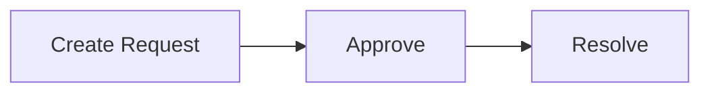
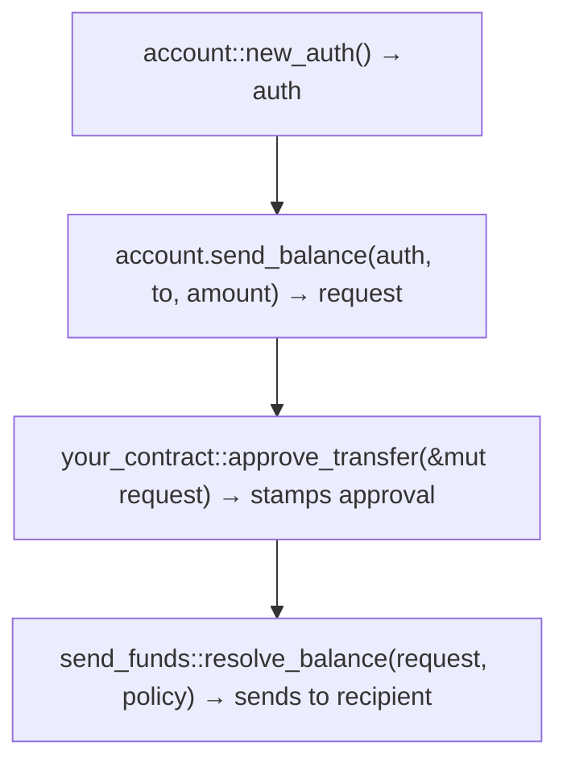

Permissioned Asset Standard (PAS)는 Sui의 permissioned asset framework이다. 서로 다른 type의 asset은 **Accounts** 아래에 존재하며(address마다 하나, type과 독립적), 동일한 programmable transaction block (PTB) 안에서 approve되고 resolve되어야 하는 hot potato request를 통해서만 Account 사이를 이동할 수 있다.

모든 action은 같은 pattern을 따른다.



## Account 생성

Account creation은 permissionless이다. address마다 하나의 Account가 있으며, Account는 어떤 asset type이든 보유할 수 있다.

```move
account::create_and_share(&mut namespace, @0xAlice);
account::create_and_share(&mut namespace, @0xBob);
```

## 잔액 transfer

permissioned asset의 balance를 한 Account에서 다른 Account로 transfer할 수 있다. 여기에는 owner `Auth` proof가 필요하다.

request는 다음 field를 포함한다.

| **Field** | **Description** |
|---|---|
| `sender` | Wallet 또는 object address(Account address가 아님) |
| `recipient` | Wallet 또는 object address(Account address가 아님) |
| `sender_account_id` | source Account의 ID |
| `recipient_account_id` | destination Account의 derived ID |
| `funds` | transfer되는 `T` |

**Resolution**(`Balance<C>`의 경우): `send_funds::resolve_balance(request, &policy)`는 approval을 검증하고 `balance::send_funds`를 통해 balance를 recipient Account로 직접 보낸다.

`resolve_balance` function은 balance를 직접 보낸다. caller는 이를 다시 받지 않는다. balance는 바로 destination Account로 이동한다.

다음 예시는 완전한 transfer flow를 보여준다.

```move
// 1. Create auth proof
let auth = account::new_auth(ctx);

// 2. Create the transfer request (withdraws Balance from sender account)
let mut request = from_account.send_balance<MY_COIN>(
    &auth,
    &to_account,
    amount,
    ctx,
);

// 3. Approve with your witness
request.approve(MyTransferApproval());

// 4. Resolve — sends Balance to recipient account
send_funds::resolve_balance(request, &policy);
```

registry-gated transfer 구현은 [KYC example `kyc_registry`](https://github.com/MystenLabs/pas/blob/main/packages/examples/kyc/sources/kyc_registry.move)를 참조한다.

## 잔액 clawback

Account에서 token을 강제로 withdraw할 수 있다. 이는 admin action이므로 `Auth`가 필요하지 않다. policy에는 `clawback_allowed: true`가 있어야 한다.

request는 다음 field를 포함한다.

| **Field** | **Description** |
|---|---|
| `owner` | source Account의 Wallet 또는 object address |
| `account_id` | source Account의 ID |
| `funds` | clawback되는 `T` |

**Resolution:** `clawback_funds::resolve(request, &policy)`는 approval과 `policy.clawback_allowed`를 검증한 뒤 `T`를 caller에게 반환한다.

`send_funds`와 달리 caller가 funds를 받고, 이를 어떻게 처리할지(burn, 다른 곳에 deposit 등) 결정한다.

다음 예시는 clawback flow를 보여준다.

```move
// 1. Create clawback request (no Auth needed)
let mut request = from_account.clawback_balance<MY_COIN>(amount, ctx);

// 2. Approve
request.approve(MyClawbackApproval());

// 3. Resolve — returns the Balance to the caller
let balance: Balance<MY_COIN> = clawback_funds::resolve(request, &policy);

// 4. Do something with the balance (deposit elsewhere, burn, and so on)
to_account.deposit_balance(balance);
```

clawback-to-burn 구현은 [KYC example `treasury::burn`](https://github.com/MystenLabs/pas/blob/main/packages/examples/kyc/sources/treasury.move)를 참조한다.

## 잔액 unlock

closed-loop system에서 token을 완전히 제거할 수 있다.

:::caution

`unlock_funds`를 활성화하면 asset이 closed-loop system을 완전히 떠나고 이후 모든 transfer control을 bypass할 수 있다. unlock된 asset은 PAS restriction이 없는 일반 onchain object가 된다. 사용자가 managed system에서 asset을 withdraw해야 하는 use case가 명시적으로 필요한 경우에만 이 action을 허용한다.

:::

resolution path는 2개다.

| **Path** | **When to use** | **Resolution** |
|---|---|---|
| `unlock_funds::resolve(request, &policy)` | Managed asset(`Policy<T>`가 존재) | matching approval 필요 |
| `unlock_funds::resolve_unrestricted_balance(request, &namespace)` | Unmanaged balance(Policy 없음) | approval 불필요 |

unrestricted path는 `Balance<C>` 전용이다. SUI처럼 실수로 Account에 들어갈 수 있는 asset을 위해 존재한다. 해당 type에 `Policy<Balance<C>>`가 있으면 managed asset control을 bypass할 수 없으므로 abort된다.

### Managed asset(policy 존재)

다음 예시는 managed asset의 unlock flow를 보여준다.

```move
let auth = account::new_auth(ctx);
let mut request = account.unlock_balance<MY_COIN>(&auth, amount, ctx);

request.approve(MyUnlockApproval());
let balance: Balance<MY_COIN> = unlock_funds::resolve(request, &policy);
// Balance is now outside the system
```

registry-gated unlock(redemption) 구현은 [Loyalty example `treasury::redeem`](https://github.com/MystenLabs/pas/blob/main/packages/examples/loyalty/sources/treasury.move)을 참조한다.

### Unmanaged asset(policy 없음)

예를 들어 SUI가 실수로 Account로 전송된 경우:

```move
let auth = account::new_auth(ctx);
let request = account.unlock_balance<SUI>(&auth, amount, ctx);

// No approval needed — resolves with empty approval set
let balance: Balance<SUI> = unlock_funds::resolve_unrestricted_balance(request, &namespace);
```

## 잔액 deposit

Account에 token을 deposit할 수 있다. request는 필요하지 않다.

```move
account.deposit_balance(balance);
```

Account address로 직접 보낼 수도 있다. 이는 transaction에서 Account object를 사용할 수 있기 전 유용하다.

```move
balance.send_funds(namespace.account_address(owner));
```

## Move에서 action resolve(contract 내부)

contract는 자체 function 안에서 approve와 resolve를 호출한다. balance는 사용자의 control 밖으로 나가지 않는다.

```move
public fun burn(
    policy: &Policy<Balance<MY_COIN>>,
    cap: &mut TreasuryCap<MY_COIN>,
    mut request: Request<ClawbackFunds<Balance<MY_COIN>>>,
    ctx: &mut TxContext,
) {
    // Approve inside your contract
    request.approve(MyClawbackApproval());

    // Resolve — balance returned to this function
    let balance = clawback_funds::resolve(request, policy);

    // Burn the balance
    cap.burn(balance.into_coin(ctx));
}
```

**Use case:** Burn, seize 또는 contract가 balance를 필요로 하는 모든 operation. [`treasury::burn`](https://github.com/MystenLabs/pas/blob/main/packages/examples/kyc/sources/treasury.move) (KYC)와 [`treasury::redeem`](https://github.com/MystenLabs/pas/blob/main/packages/examples/loyalty/sources/treasury.move) (Loyalty)을 참조한다.

## PTB에서 action resolve(client-side)

single PTB 안에서 여러 Move call에 걸쳐 request를 만들고 approve한 뒤, 별도 Move call로 resolve한다.



**Use case:** compliance contract가 approve하고 PAS가 delivery를 처리하는 transfer.

:::info

Step 3과 4는 같은 PTB 안에 있어야 한다. request는 hot potato이다. transaction이 resolution 없이 끝나면 abort된다.

:::

## 예제 package

| **Example** | **Actions** | **Approval pattern** |
|---|---|---|
| [Loyalty](https://github.com/MystenLabs/pas/tree/main/packages/examples/loyalty) | `send_funds`(permissionless), `unlock_funds`(per-address registry) | Transfer는 open 상태이고 point는 system에 남는다. Redemption은 `RedeemRegistry`로 gate되고 Move에서 resolve된다. unlock되면 funds는 managed system을 완전히 떠난다. |
| [KYC](https://github.com/MystenLabs/pas/tree/main/packages/examples/kyc) | `send_funds`(KYC registry), `clawback_funds`(issuer) | 모든 transfer는 recipient를 `KYCRegistry`에 대해 check한다. Clawback은 무조건 approve되어 issuer가 어떤 account의 token도 burn할 수 있게 한다. |
