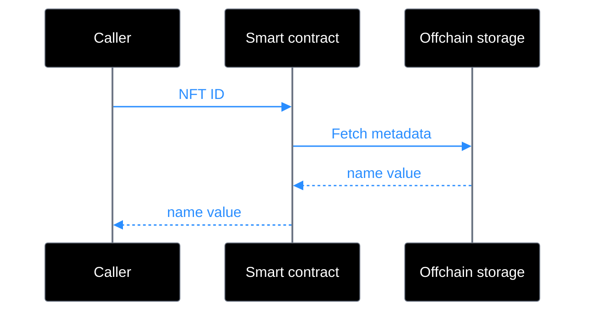

Sui에서는 모든 object가 고유하며 owner가 있다. 이는 Ethereum 같은 다른 블록체인이 [ERC-721](https://erc721.org/) 같은 전용 standard를 필요로 하는 속성이다.

Sui와 object 기반이 아닌 다른 블록체인에서 Rare Reef Shark NFT 컬렉션을 만든다고 가정해 보자. 다른 블록체인에서 shark의 이름 같은 속성을 얻으려면 NFT ID를 사용해 해당 NFT를 만든 smart contract와 상호작용해야 한다. 일반적으로 이 정보는 offchain storage에서 가져온다. Sui에서는 name 속성이 NFT 자체를 정의하는 object의 field이다. 이 구조는 정보를 필요로 하는 smart contract가 object에서 name을 직접 반환할 수 있으므로 NFT metadata에 더 직접적으로 접근할 수 있게 한다.

## 사용 사례

Sui의 NFT는 다양한 애플리케이션에서 유용하다.

- **디지털 수집품**: 고유한 attribute와 provenance를 가진 art, trading card, 인게임 character 같은 고유 item. [SuiFrens](https://suifrens.com/)는 Sui의 collectible NFT collection 예시이다.
- **게임 자산**: weapon, skin, land parcel 같은 인게임 item. 각 asset은 고유한 속성을 가지며 호환되는 game 전반에서 소유, 거래, 사용할 수 있다.
- **이벤트 티켓과 access pass**: holder에게 event, community, gated experience에 대한 접근 권한을 부여하는 ticket 또는 credential. 고유성과 ownership은 온체인에서 검증할 수 있다.
- **Identity와 credential**: certification, membership, reputation score 같은 전송 불가능한 credential을 나타내는 soulbound NFT.
- **NFT rental**: Kiosk extension을 사용해 정의된 기간 동안 NFT를 다른 user에게 대여할 수 있다. 이를 통해 holder가 asset을 판매하지 않고 monetization하려는 use case를 지원한다.
- **암호화된 미디어**: NFT는 암호화된 콘텐츠를 래핑하여 owner만 underlying asset에 접근할 수 있게 할 수 있으며, 이는 freemium 및 try-before-you-buy model을 가능하게 한다.

## NFT와 토큰화된 자산

Sui에서 NFT와 [tokenized asset](/onchain-finance/tokenized-assets/asset-tokenization)은 모두 object이다. 프로토콜은 둘을 구분하지 않는다. 차이는 smart contract를 설계하는 방식에 있다.

NFT는 일반적으로 supply가 1이고 name, description, image URL처럼 해당 instance에 특화된 metadata를 가진 object이다. tokenized asset은 supply가 1보다 크고 모든 fraction에서 metadata를 공유하는 fractional ownership용으로 설계된다. tokenized asset은 split 또는 merge할 수도 있지만 NFT는 이를 위해 설계되지 않는다.

다음 표는 핵심 설계 차이를 요약한다.

| 속성 | NFT | 토큰화된 자산 |
|---|---|---|
| Supply | 1 | 1보다 큼 |
| Metadata | token마다 고유 | 모든 fraction에서 공유 |
| Divisibility | 분할 불가 | 분할 가능(split 또는 merge) |
| Use case | 단일 item의 고유 ownership | asset의 fractional ownership |
| 예시 | 고유한 digital art 작품 | real estate의 fractional share |

## 예시

다음 예시는 Sui에서 기본 NFT를 만든다. `TestnetNFT` struct는 `id`, `name`, `description`, `url` field를 사용해 NFT를 정의한다.

<ImportContent source="examples/move/nft/sources/testnet_nft.move" mode="code" struct="TestnetNFT" noComments />

이 예시에서는 누구나 `mint_to_sender` 함수를 호출하여 NFT를 mint할 수 있다. 이 함수는 새 `TestnetNFT`를 만들고 호출을 수행한 address로 전송한다.

<ImportContent source="examples/move/nft/sources/testnet_nft.move" mode="code" fun="mint_to_sender" noComments />

module에는 NFT metadata를 반환하는 함수가 포함되어 있다. `name` 함수를 호출해 해당 값을 가져올 수 있다. 이 함수는 NFT object에서 name field 값을 직접 반환한다.

<ImportContent source="examples/move/nft/sources/testnet_nft.move" mode="code" fun="name" noComments />

`testnet_nft.move`

<ImportContent source="examples/move/nft/sources/testnet_nft.move" mode="code" />

