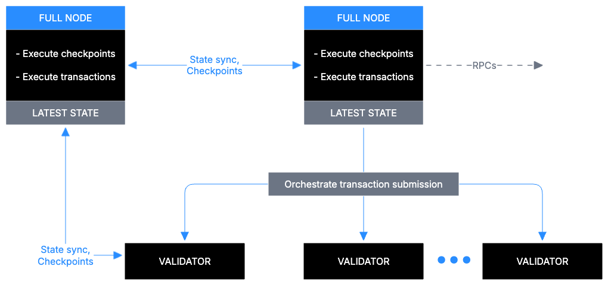

Sui 풀 노드의 데이터를 관리하는 일은 건전한 Sui 네트워크를 유지하는 데 중요하다. 이 주제는 풀 노드 구성을 최적화하는 데 사용할 수 있는 Sui 풀 노드의 데이터 management를 상위 수준에서 설명한다. pruning policies와 archival settings 같은 Sui 풀 노드 관련 자세한 내용은 [Sui 풀 노드 구성](/operators/full-node/sui-full-node)를 참고한다.

## 기본 Sui 풀 노드 기능

최소 기능의 Sui 풀 노드는 Sui validators가 commit하는 모든 트랜잭션을 실행한다. Sui 풀 노드는 시스템에 새 트랜잭션을 제출하는 일도 orchestrate한다:



앞의 이미지는 데이터가 풀 노드를 통해 어떻게 흐르는지 보여준다:

1. **`State sync` 프로토콜:** Sui 풀 노드는 상태 동기화를 달성하기 위해 다음을 수행한다:
   - p2p gossip-like 프로토콜을 통해 commit된 체크포인트에 대한 정보를 가져온다.
   - effects가 validator quorum이 인증한 effects와 일치하는지 검증하기 위해 트랜잭션을 로컬에서 실행한다.
   - 그에 따라 최신 객체 값으로 로컬 state를 업데이트한다.
2. **RPCs:** Sui 풀 노드는 시스템의 최신 state를 쿼리하기 위한 Sui RPC 엔드포인트를 노출하며, 여기에는 최신 state metadata(예: `sui_getProtocolConfig`)와 최신 state 객체 데이터 (`sui_getObject`)가 모두 포함된다.
3. **트랜잭션 submission:** 각 Sui 풀 노드는 Sui validators quorum에 대한 트랜잭션 submission을 orchestrate하고, 설정된 경우 선택적으로 확정된 트랜잭션을 로컬에서 실행하는데(이를 fast path execution이라고 한다), 이렇게 하면 체크포인트 동기화을 기다리지 않아도 된다.

## Sui 풀 노드 데이터 및 RPC 유형

Sui 풀 노드는 영구 store에 여러 범주의 데이터를 저장한다.

:::info

per-에포크 Sui store는 이 주제의 범위를 벗어난다. Sui는 authority 및 consensus 작업을 위해 per-에포크 store를 내부적으로 사용한다. 이 store는 각 에포크 시작 시 재설정된다.

:::

Sui 풀 노드는 다음 유형의 데이터를 저장한다:

1. **트랜잭션 with associated effects and 이벤트:** Sui는 고유한 트랜잭션 digest를 사용해 트랜잭션, 그 effects, 그리고 발생한 이벤트에 대한 정보를 조회한다. 기본적인 풀 노드 작업에는 과거 트랜잭션 정보가 필요하지 않다. drive space를 절약하려면 pruning을 활성화해 이 과거 데이터를 제거할 수 있다.
2. **체크포인트:** Sui는 commit된 트랜잭션을 체크포인트로 묶은 다음, 그 체크포인트를 사용해 상태 동기화를 달성한다. 체크포인트는 추가 integrity metadata를 포함하는 트랜잭션 digests를 유지한다. Sui 풀 노드는 트랜잭션을 실행하고 제출하는 데 체크포인트의 데이터가 필요하지 않으므로, 이 데이터에도 pruning을 구성할 수 있다.
3. **객체:** 객체를 변경하는 트랜잭션은 새로운 객체 versions를 만든다. 각 객체는 객체를 식별하는 데 사용되는 고유한 `(objectId, version)` 쌍을 가진다. Sui 풀 노드는 트랜잭션을 실행하고 제출하는 데 과거 객체 versions가 필요하지 않으므로, 풀 노드가 이 데이터도 pruning하도록 구성할 수 있다.
4. **Indexing information:** 풀 노드의 기본 구성은 commit된 트랜잭션을 후처리하는 것이다. 즉, 효율적인 aggregation 및 filtering 쿼리를 가능하게 하도록 commit된 정보를 indexing한다. 예를 들어, indexing은 특정 sender의 과거 트랜잭션을 모두 가져오거나 주소가 소유한 모든 객체를 찾는 데 유용할 수 있다.

Sui 풀 노드는 40개가 넘는 RPC types를 지원하며, 여기에는 다음 범주가 포함된다:

* **General metadata**, 예: `sui_getProtocolConfig`, `sui_getChainIdentifier`. 이러한 요청은 추가 indexing에 의존하지 않으며, 처리에 과거 데이터가 필요하지 않다.
* **Direct lookups**, 예: `sui_getObject`, `sui_getEvents`. 이러한 요청은 추가 indexing에 의존하지 않지만, `sui_tryGetPastObject`와 `sui_getTransactionBlock` 같은 경우에는 과거 데이터가 필요하다.
* **Accumulation and filtering 쿼리**, 예: `suix_getOwnedObjects`, `suix_getCoins`. 이러한 요청은 추가 indexing에 의존하며, `suix_queryTransactionBlocks` 같은 경우에는 과거 데이터가 필요하다.

:::info

<ImportContent source="data-serving-msg" mode="snippet" />

:::

## Sui archival 데이터

Sui archive 인스턴스는 genesis 이후의 전체 Sui 트랜잭션 history를 데이터베이스-agnostic 형식으로 저장한다. 여기에는 트랜잭션(클라이언트 인증 포함), effects, 이벤트, 체크포인트에 대한 정보가 포함된다. 따라서 archival 스토리지는 데이터 auditing과 과거 트랜잭션 재실행에 사용할 수 있다.

처음부터 시작하는 풀 노드는 아카이브를 저장하는 cloud bucket을 가리키도록 `fullnode.yaml` 구성 파일에서 [configuring archival fallback](/operators/data-management/archives#set-up-archival-fallback)을 설정해, 주어진 archive에서 Sui genesis 이후 발생한 트랜잭션을 replay하고(따라서 다시 검증하고) 시작할 수 있다.

피어로부터 상태 동기화 프로토콜을 통해 체크포인트를 가져오지 못하는 Sui 풀 노드는 미리 구성한 archive에서 누락된 체크포인트를 다운로드하는 방식으로 폴백한다. 이 폴백을 통해 풀 노드는 peers의 pruning policies와 관계없이 시스템의 나머지 부분을 따라잡을 수 있다.

## Sui 노드 pruning policy

앞서 설명했듯이, 지속 가능한 disk usage를 위해서는 Sui 노드s(validators와 풀 노드)가 과거 객체 versions 정보와 해당 effects 및 이벤트를 포함한 과거 트랜잭션 정보, 그리고 오래된 체크포인트 데이터를 pruning해야 한다.

트랜잭션 pruner와 객체 pruner는 모두 백그라운드에서 실행된다. RocksDB에서 entries를 논리적으로 삭제하면 결국 disk상의 데이터에 대한 물리적 compaction이 촉발되며, 이는 RocksDB background jobs가 제어한다. 따라서 pruning이 disk usage에 미치는 효과는 즉각적이지 않으며 며칠이 걸릴 수 있다.

객체 pruning policies에 대해 더 알아보려면 [객체 pruning](#object-pruning)을 참고한다. pruner는 두 가지 모드로 구성할 수 있다:
* **aggressive pruning** (`num-epochs-to-retain: 0`): Sui는 오래된 객체 versions를 가능한 한 빨리 pruning한다. 이 모드는 노드가 read 쿼리를 제공하지 않을 때만 사용해야 한다.
* **에포크-based pruning** (`num-epochs-to-retain: X`): Sui는 X 에포크 이후에 오래된 객체 versions를 pruning한다.

:::tip
일부 history(5 에포크)를 유지하면 remote 스토리지보다 local disk에서 더 많은 lookups가 가능해져 풀 노드의 RPC 성능이 더 좋아진다.
:::

트랜잭션 pruning policies에 대해 더 알아보려면 [트랜잭션 pruning](#transaction-pruning)을 참고한다. 트랜잭션 pruning을 구성하려면 `num-epochs-to-retain-for-checkpoints: X` 구성 옵션을 지정한다. 트랜잭션, effects, 이벤트를 포함한 체크포인트는 X 에포크 전까지 pruning된다. 트랜잭션 pruning은 2 에포크로 설정하는 것을 권장한다.

## 객체 pruning {#object-pruning}

Sui는 트랜잭션 execution의 일부로 데이터베이스에 새로운 객체 versions를 추가한다. 이로 인해 이전 versions는 garbage collection 대상이 된다. 하지만 pruning이 없으면 데이터베이스 성능이 저하될 수 있고 많은 스토리지 space가 필요하다. Sui는 각 체크포인트에서 pruning 대상 객체를 식별한 다음 백그라운드에서 pruning을 수행한다.

Sui 노드에서 pruning을 활성화하려면 `authority-store-pruning-config` 파일에 `fullnode.yaml` 구성을 추가한다:
```yaml
authority-store-pruning-config:
  # Number of epoch dbs to keep
  # Not relevant for object pruning
  num-latest-epoch-dbs-to-retain: 3
  # The amount of time, in seconds, between running the object pruning task.
  # Not relevant for object pruning
  epoch-db-pruning-period-secs: 3600
  # Number of epochs to wait before performing object pruning.
  # When set to 0, Sui prunes old object versions as soon
  # as possible. This is also called *aggressive pruning*, and results in the most effective
  # garbage collection method with the lowest disk usage possible.
  # This is the recommended setting for Sui Validator nodes since older object versions aren't
  # necessary to execute transactions.
  # When set to 1, Sui prunes only object versions from transaction checkpoints
  # previous to the current epoch. In general, when set to N (where N >= 1), Sui prunes
  # only object versions from checkpoints up to `current - N` epoch.
  # It is therefore possible to have multiple versions of an object present
  # in the database. This setting is recommended for Sui Full nodes as they might need to serve
  # RPC requests that require looking up objects by ID and Version (rather than just latest
  # version). However, if your full node does not serve RPC requests you should then also enable.
  # aggressive pruning.
  num-epochs-to-retain: 1
  # Advanced setting: Maximum number of checkpoints to prune in a batch. The default
  # settings are appropriate for most use cases.
  max-checkpoints-in-batch: 10
  # Advanced setting: Maximum number of transactions in one batch of pruning run. The default
  # settings are appropriate for most use cases.
  max-transactions-in-batch: 1000
```
## 트랜잭션 pruning {#transaction-pruning}

트랜잭션 pruning은 이전 트랜잭션와 effects를 데이터베이스에서 제거한다. Sui는 주기적으로 체크포인트를 생성한다. 각 체크포인트에는 해당 체크포인트 동안 발생한 트랜잭션와 그에 연결된 effects가 포함된다.

Sui는 체크포인트가 완료된 뒤 백그라운드에서 트랜잭션 pruning을 수행한다.

풀 노드 또는 validator 노드에서 트랜잭션 pruning을 활성화하려면 노드의 `num-epochs-to-retain-for-checkpoints` 구성에 `authority-store-pruning-config`를 추가한다:

```yaml
authority-store-pruning-config:
  num-latest-epoch-dbs-to-retain: 3
  epoch-db-pruning-period-secs: 3600
  num-epochs-to-retain: 0
  max-checkpoints-in-batch: 10
  max-transactions-in-batch: 1000
  # Number of epochs to wait before performing transaction pruning.
  # When this is N (where N >= 2), Sui prunes transactions and effects from
  # checkpoints up to the `current - N` epoch. Sui never prunes transactions and effects from the current and
  # immediately prior epoch. N = 2 is a recommended setting for Sui Validator nodes and Sui Full nodes that don't
  # serve RPC requests.
  num-epochs-to-retain-for-checkpoints: 2
  # Ensures that individual database files periodically go through the compaction process.
  # This helps reclaim disk space and avoid fragmentation issues
  periodic-compaction-threshold-days: 1
```

:::info

트랜잭션을 pruning하더라도 archival 노드는 뒤처진 peer 노드가 어떤 정보도 잃지 않도록 도울 수 있다. 자세한 내용은 [Sui 아카이브](/operators/data-management/archives)를 참고한다.

:::


## pruning policy 예시

이 섹션의 예시를 사용해 Sui 풀 노드를 구성한다. 예시를 그대로 복사한 다음, 필요하다면 환경에 맞게 값을 수정할 수 있다.

### Validator 및 State Sync 풀 노드

이 구성은 disk usage를 최소화한다. read traffic을 제공하지 않는 validators와 상태 동기화 풀 노드에 적합하다. 이 구성을 사용하는 풀 노드는 indexing이나 과거 데이터가 필요한 쿼리에 응답할 수 없다.

```yaml
# Do not generate or maintain indexing of Sui data on the node
enable-index-processing: false

authority-store-pruning-config:
  # Prune obsolete object versions immediately.
  num-epochs-to-retain: 0
  # Prune historic transactions of the past epochs
  num-epochs-to-retain-for-checkpoints: 2
```

### indexing이 있지만 객체 history가 제한된 풀 노드

이 설정은 최신 state에 더해 secondary indexing도 관리하지만, 몇 에포크가 지나면 과거 데이터는 pruning한다. 이 구성을 사용하는 풀 노드는 다음을 수행한다:

- `suix_getBalance()` 같은 indexing이 필요한 RPC 쿼리에 응답한다.
- 과거 트랜잭션이 필요한 RPC 쿼리는 원격 키-값 스토어에서 데이터를 가져오는 폴백을 통해 응답한다: `sui_getTransactionBlock()`.

```yaml
authority-store-pruning-config:
  # Retain 5 epochs of object versions for better RPC performance
  num-epochs-to-retain: 5
  # Prune historic transactions of the past epochs
  num-epochs-to-retain-for-checkpoints: 2
```

### 전체 객체 history가 있지만 트랜잭션 history가 pruned된 풀 노드

이 구성은 전체 객체 history를 관리하면서도 과거 트랜잭션 history는 계속 pruning한다. 이 구성을 사용하는 풀 노드는 트랜잭션 데이터에 대해서는 트랜잭션 쿼리 fallback을 사용해, `showBalanceChanges`의 `sui_getTransactionBlock()` filter처럼 과거 객체가 필요한 쿼리를 포함한 모든 과거 및 indexing 쿼리에 응답할 수 있다.

가장 큰 주의점은 현재 설정에서는 **트랜잭션 pruner**가 **객체 pruner**보다 앞서 진행된다는 점이다. 이미 pruning된 트랜잭션이 수정한 객체를 **객체 pruner**가 제대로 정리하지 못할 수 있다. 이 구성을 사용하는 풀 노드에서는 disk space 증가를 면밀히 모니터링해야 한다.

일반적인(pruned) snapshots에 더해, Mysten Labs는 이 구성을 사용하는 operators가 이용할 수 있도록 객체 versions의 전체 history를 포함하는 특별한 RocksDB snapshots도 유지한다.

```yaml
authority-store-pruning-config:
  # No pruning of object versions with u64::max for num of epochs.
  # Set a lower value for a smaller objects history.
  num-epochs-to-retain: 18446744073709551615
  # Prune historic transactions of the past epochs
  num-epochs-to-retain-for-checkpoints: 2
```
