이 문서는 Sui documentation의 technical diagramming standard를 정의한다. 이 guideline은 모든 technical documentation, diagram, visual aid에서 consistency, clarity, brand alignment를 보장한다.

:::info

모든 style guide와 마찬가지로 이 문서는 계속 갱신되는 living document이다.

:::


## C4 model

Sui documentation의 diagram은 [software architecture용 C4 model](https://c4model.com/)을 따른다. C4 model은 diagram을 system context, container, component, code의 4개 abstraction level로 구성한다. 각 level은 서로 다른 질문에 답하고 서로 다른 audience를 대상으로 한다. drawing을 시작하기 전에 적절한 level을 선택하면 diagram이 focused 상태를 유지하고 concern이 섞이는 것을 방지할 수 있다.

| **C4 level** | **Diagram type** | **Sui example** | **Scope and audience** |
| --- | --- | --- | --- |
| Level 1: System context | Context diagram | Sui network와 external wallet | stakeholder와 decision maker; system이 무엇이고 누가 사용하는지 보여준다 |
| Level 2: Container | Architecture diagram | Full Node, Indexer, RPC Server, Archival Store | developer; major deployable unit과 data flow를 보여준다 |
| Level 3: Component | Component diagram | Full Node 내부의 Move VM, Consensus Engine, Object Store | engineer와 contributor; container의 internal structure를 보여준다 |
| Level 4: Code | Sequence 또는 flow diagram | Move bytecode execution을 통한 transaction lifecycle | implementer; call sequence, state change, decision logic을 보여준다 |

하나의 diagram은 C4 level을 섞으면 안 된다. 예를 들어 container-level architecture diagram은 node 안에 component-level detail을 embed하면 안 된다. 그 detail이 필요하다면 적절한 level의 companion diagram을 만들고 caption에서 cross-reference한다.

### 적절한 level 선택

- 새 reader에게 Sui subsystem을 소개할 때는 Level 1(system context)에서 시작한다.
- docs의 Concepts section에 있는 대부분의 architecture diagram에는 Level 2(container)를 사용한다.
- Sui Full Node 같은 특정 binary의 internal structure를 문서화할 때는 Level 3(component)을 사용한다.
- transaction lifecycle처럼 step-by-step execution을 보여주는 sequence diagram과 flowchart에는 Level 4(code)를 사용한다.


## 도구

필요한 tool은 diagram type과 complexity에 따라 달라진다. 정밀한 visual control이 필요한 큰 architecture diagram에는 Excalidraw가 가장 적합하다. flowchart, sequence diagram, plain text로 version control하는 이점이 있는 diagram에는 Mermaid.js가 가장 적합하다.

### Excalidraw

5개가 넘는 node가 있는 diagram에는 Excalidraw를 권장한다. Excalidraw는 [excalidraw.com](https://excalidraw.com)의 browser에서 실행되며 brand standard에 맞는 깔끔한 SVG와 PNG export를 생성한다. 더 작은 diagram에는 Mermaid.js가 더 나은 선택인 경우가 많다.

diagram을 만들기 전에 다음 option을 구성한다.

#### 도형

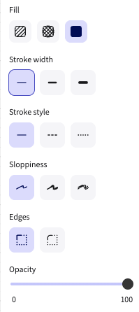

- **Fill:** Full-color fill(가장 오른쪽 option)
- **Stroke width:** Thinnest(가장 왼쪽 option)
- **Sloppiness:** None(가장 왼쪽 option)
- **Edges:** Sharp(왼쪽 option)
- **Opacity:** 100

#### 화살표

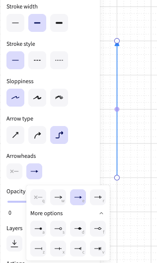

모든 arrow element에 다음 setting을 사용한다.

- **Sloppiness:** None(가장 왼쪽 option)
- **Arrowheads:** Solid triangle arrowhead
- **Opacity:** 100

#### 텍스트

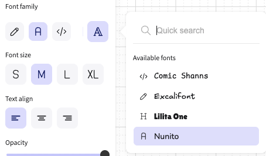

font family를 **Nunito**로 설정한다.

### Mermaid.js

Sui documentation은 GitHub에서 Docs as Code로 유지되므로, 자주 바뀌거나 code와 sync 상태를 유지해야 하는 diagram에는 Mermaid.js가 강력한 선택이다. Mermaid diagram은 plain text이므로 version control, pull request review, 별도 design tool 없이 update하기 쉽다.

Mermaid.js는 모든 C4 diagram type을 지원하지만 system complexity가 커지면 관리하기 어려워진다. 특히 flowchart와 sequence diagram에서는 diagram이 straightforward하거나 시간이 지나며 evolve될 가능성이 있을 때 Excalidraw보다 Mermaid.js가 더 나은 선택인 경우가 많다. 많은 node, custom fill, operator-boundary grouping 또는 multi-tier layout이 있는 큰 architecture diagram에는 Excalidraw를 사용한다.

다음 중 하나에 해당하면 Mermaid.js를 사용한다.

- diagram이 straightforward structure를 가진 flowchart 또는 sequence diagram이다.
- diagram이 자주 바뀔 것으로 예상되며 version control의 이점이 있다.
- diagram에 node가 5개 이하이고 custom fill, dashed boundary, multi-tier layout이 필요하지 않다.

색상을 Sui brand palette에 맞추려면 모든 Mermaid diagram에 다음 frontmatter를 적용한다.

```yaml
config:
  theme: base
  themeVariables:
    primaryColor: '#000000'
    primaryTextColor: '#FFFFFF'
    primaryBorderColor: '#6C7584'
    secondaryColor: '#6C7584'
    secondaryTextColor: '#FFFFFF'
    tertiaryColor: '#298DFF'
    tertiaryTextColor: '#FFFFFF'
    lineColor: '#298DFF'
    background: '#FFFFFF'
    mainBkg: '#000000'
    secondBkg: '#6C7584'
    noteBkgColor: '#E6F1FB'
    noteTextColor: '#000000'
    noteBorderColor: '#298DFF'
    activationBkgColor: '#298DFF'
    activationBorderColor: '#185FA5'
    fontSize: '14px'
    fontFamily: 'Inter, sans-serif'
    signalColor: '#298DFF'
    signalTextColor: '#298DFF'
    labelBoxBkgColor: '#000000'
    labelBoxBorderColor: '#6C7584'
    labelTextColor: '#FFFFFF'
    loopTextColor: '#FFFFFF'
```


## Brand style

Diagramming과 visual style은 [Sui Brand Kit](https://live.standards.site/sui-media-kit)를 기반으로 조정한다.

### 색상

Sui brand core palette color는 다음과 같다.

| **Color** | **Hex value** | **Recommended use** |
| --- | --- | --- |
| Black | `#000000` | primary node, system boundary(C4 system box) |
| White | `#FFFFFF` | dark fill 위의 label text |
| Gray 500 | `#6C7584` | secondary node, supporting component |
| Sui Blue 500 | `#298DFF` | arrow, tertiary node, callout |

recommended use column은 best-practice guidance를 설명하며 hard requirement는 아니다. core palette, Extended Blue(Blue 50-900), Extended Gray(Gray 50-900) palette의 hex value와 정확히 일치하는 모든 color는 WCAG AA graphic contrast(3:1)를 유지한다면 사용할 수 있다. 이 palette 밖의 color는 허용되지 않는다. clarity를 유지하기 위해 fill color가 3개보다 많이 필요하면 먼저 Gray extended palette로 확장하고, 그다음 Blue extended palette로 확장한다. extended palette는 [https://live.standards.site/sui-media-kit/sui-color](https://live.standards.site/sui-media-kit/sui-color)를 참조한다.

### 타이포그래피

Sui Brand Kit는 TWK Everett을 primary typeface로 지정한다. TWK Everett을 사용할 수 없을 때는 Inter를 approved backup으로 사용한다.

Excalidraw diagram에는 가장 가까운 available match인 Nunito font family를 사용한다. 다른 모든 tooling에는 Sui Brand Kit site에서 Inter를 download해 사용한다.


## Core diagram standards

다음 rule은 C4 level과 관계없이 모든 diagram type에 적용된다.

### 레이아웃

- **Flow direction:** horizontal data flow에는 left-to-right를 사용하고(data-serving architecture diagram처럼), vertical execution flow에는 top-to-bottom을 사용한다(transaction lifecycle sequence diagram처럼).
- **Alignment:** 모든 node를 grid에 snap한다. 같은 level의 related node는 horizontal 또는 vertical baseline을 공유해야 한다.
- **Grouping:** 같은 operator-controlled zone에 속하는 node를 group하려면 labeled boundary rectangle을 사용한다. boundary label은 rectangle의 top-left corner에 sentence case로 배치하고, 어떤 node 밖에 둔다.
- **White space:** Excalidraw에서는 node와 boundary edge 사이에 최소 40px padding을 둔다.
- **Complexity:** diagram에 node가 15개를 넘으면 적절한 C4 level의 여러 focused diagram으로 나눈다. child를 reference하는 parent context diagram을 추가한다.

### 도형

각 shape는 특정 C4 element를 encode한다. 지정되지 않은 element에 shape를 재사용하지 않는다.

| **Shape** | **C4 element** | **Recommended use** |
| --- | --- | --- |
| Rectangle (filled) | System, container, component | primary node: process, service, Sui Full Node, indexer, RPC server. emphasis level에 따라 Black(primary), Gray 500(secondary), Sui Blue 500(tertiary)으로 fill한다. |
| Rectangle (outline only) | Person / actor | external user 또는 operator role. Gray 500 outline과 black label text를 사용한다. |
| Rectangle with dashed border | External system | Sui boundary 밖의 third-party service. Gray 500 dashed stroke를 사용한다. |
| Diamond | Decision node | flowchart와 sequence diagram의 conditional logic에만 사용한다. architecture 또는 context diagram에는 사용하지 않는다. |
| Cylinder or server icon | Database / data store | persistent storage: Postgres DB, object store, archival store. 제공된 `server-icon-minimal.svg`를 사용한다. |
| Ellipse or labeled group boundary | Boundary / zone | data-serving diagram의 "Data indexer operator stack" 같은 operator-controlled boundary. Gray 700 outline과 top의 sentence-case label을 사용한다. |

### Color and emphasis

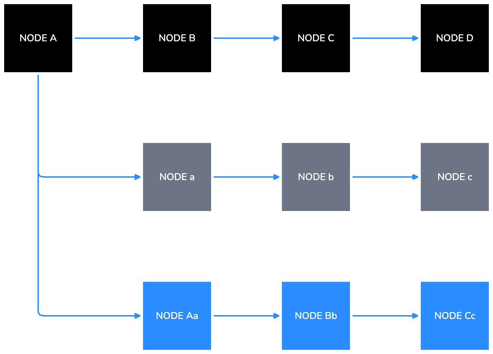

모든 element에서 emphasis level을 encode하기 위한 권장 fill color로 Black, Gray 500, Sui Blue 500을 사용한다.

- **Primary elements:** Black fill, white label.
- **Secondary elements:** Gray 500 fill, white label text.
- **Tertiary elements and arrows:** Sui Blue 500.
- **Boundary outlines:** Extended Gray palette를 먼저 사용하고, 그다음 extended Blue palette를 사용한다.

on-palette color(core, Extended Blue, Extended Gray)는 WCAG AA graphic contrast(3:1)를 유지하는 한 사용할 수 있다. color role assignment는 guidance이며 hard requirement가 아니다.

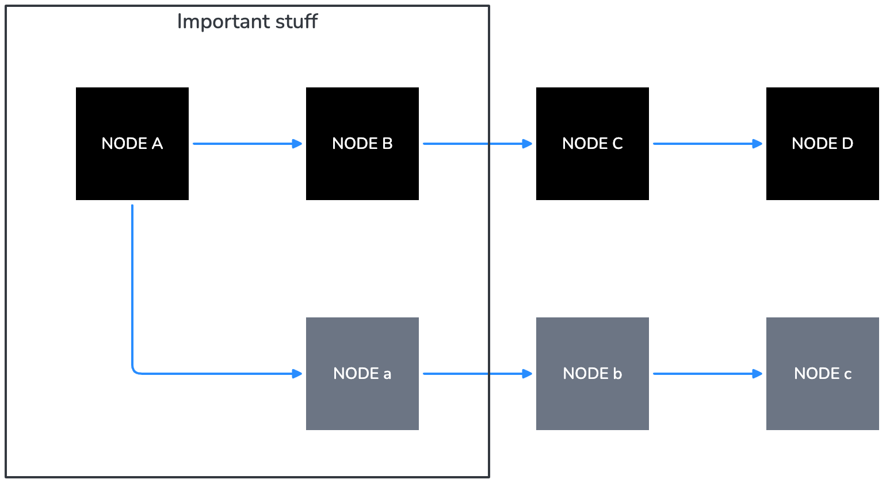

### 텍스트

- **Primary node labels:** ALL CAPS.
- **Secondary labels and sub-labels** inside a node(예: node 아래 protocol name gRPC): sentence case, contrast에 따라 Sui Blue 500 text 또는 white text.
- **Boundary labels and diagram captions:** Sentence case.
- node 안의 모든 text는 horizontally 및 vertically centered여야 한다.

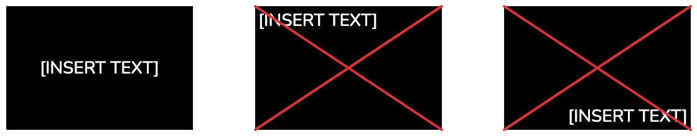

- vertical text는 피한다. vertical text가 불가피하다면(예: swimlane header) counter-clockwise 90 degrees로 rotate하여 text가 bottom-to-top으로 읽히게 한다.

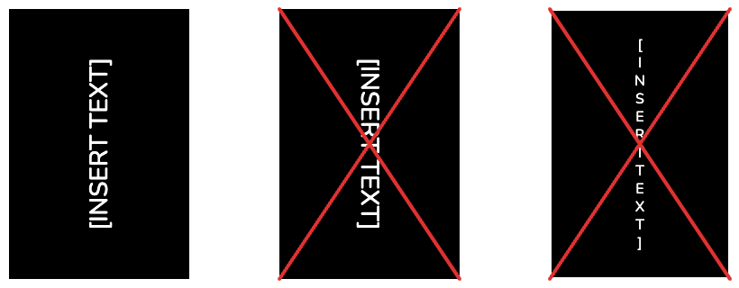

- 모든 diagram에서 terminology를 일관되게 사용한다. canonical name은 [Style Guide](https://docs.sui.io/style-guide)를 참조한다.

### 화살표

Sui Blue 500(`#298DFF`)은 모든 arrow의 recommended stroke color이다. 충분한 contrast를 유지하는 on-palette color도 사용할 수 있지만 off-palette color는 허용되지 않는다. 아래 table은 3가지 arrow style과 해당 C4 relationship type을 정의한다.

| **Arrow style** | **C4 relationship type** | **When to use** |
| --- | --- | --- |
| Solid line, filled triangle head, Sui Blue 500 | Synchronous call 또는 direct data flow | container 또는 component 사이의 primary data 및 control flow. gRPC call, direct indexer feed, RPC response에 사용한다. |
| Dashed line, open arrowhead, Sui Blue 500 | Asynchronous 또는 optional relationship | weak dependency, optional query path, primary path를 bypass하는 read. data-serving diagram의 custom RPC server path에 사용한다. |
| Solid line, no arrowhead | Bidirectional 또는 membership | 드물게 사용한다. explicit directional arrow를 선호한다. 관계가 실제로 symmetric일 때만 사용한다. |

### 접근성

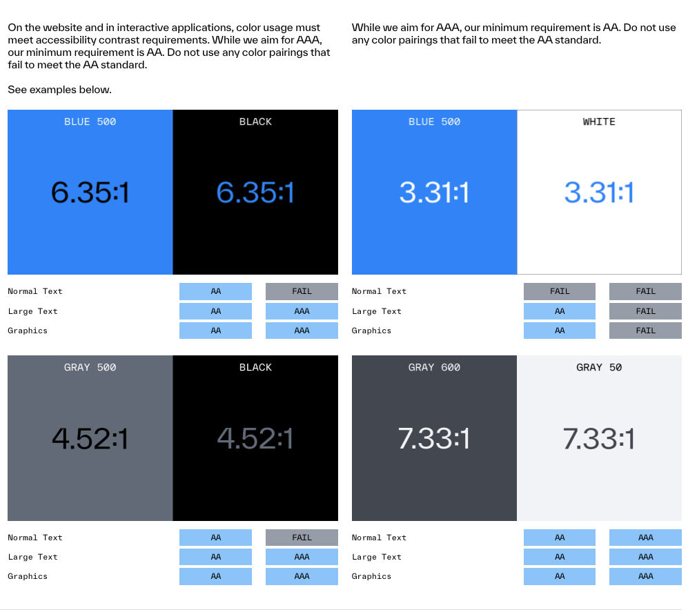

- 모든 diagram text는 WCAG AA graphic minimum contrast(3:1)를 충족해야 한다. Diagram은 text를 graphic 또는 UI component로 취급하므로 4.5:1 normal-text threshold가 아니라 3:1 graphic threshold가 적용된다.
- element를 구분할 때 color에만 의존하지 않는다. shape, arrow style 또는 label을 함께 사용한다.
- Black(`#000000`) 또는 Gray 500(`#6C7584`) fill 위에는 white text를 선호한다. Sui Blue 500(`#298DFF`) 위의 White(`#FFFFFF`)는 약 3.31:1 contrast를 달성하므로 3:1 graphic AA threshold를 통과하며 허용된다.
- 모든 node에 label을 붙인다. meaning 전달을 position 또는 color에만 의존하지 않는다.
- commit 전에 400px wide(mobile)와 1200px wide(desktop)에서 readability를 test한다.


## Diagram type

Sui documentation은 4가지 diagram type을 사용하며, 각 type은 C4 level에 mapping된다. 다음 section은 각 type의 layout rule과 design decision을 설명한다.

### Architecture diagram

Architecture diagram은 "이 system의 major component는 무엇이며 어떻게 communicate하는가?"라는 질문에 답한다. C4 Level 2(container) 또는 Level 3(component)에 해당한다.

다음은 [Data Serving](/develop/accessing-data/data-serving) concept page의 Future State Data Serving Stack diagram을 재현한 예시다.

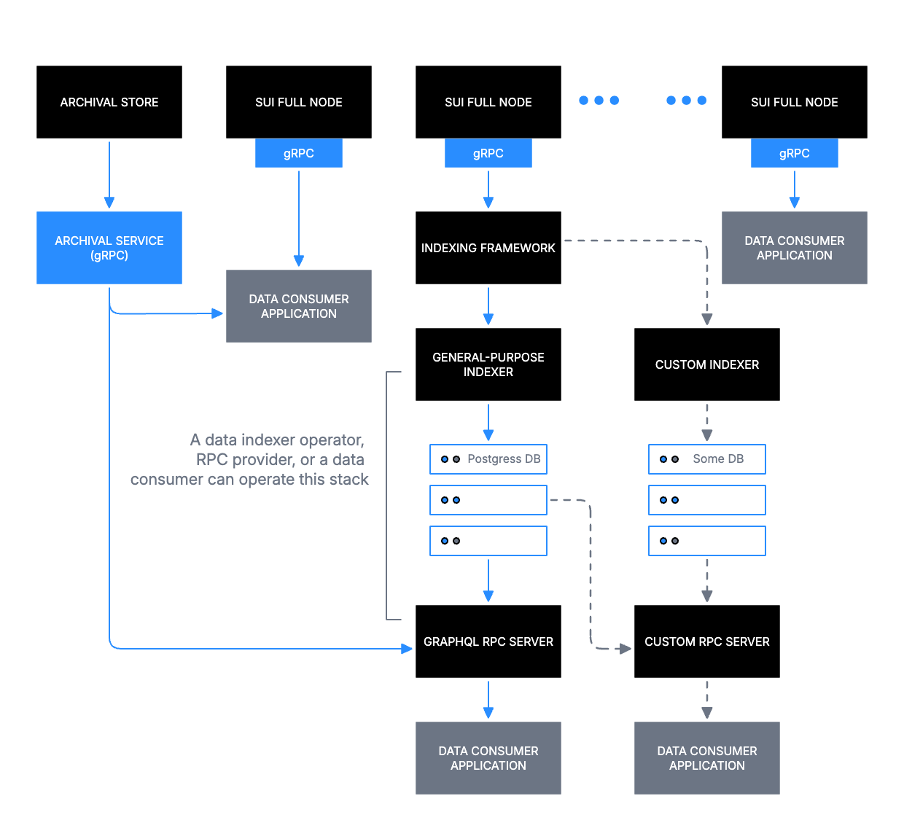

예시 diagram은 top tier의 Sui Full Nodes가 Indexing Framework로 feed되고, 이것이 General-purpose Indexer(Postgres DB 포함)와 Custom Indexer(custom database 포함)로 branch된 뒤 consumer-facing RPC server에서 끝나는 구조를 보여준다. 이 diagram의 주요 decision은 다음과 같다.

- top-to-bottom reading order는 source(Sui Full Nodes)에서 consumer(Data Consumer Application)로 이어지는 data flow에 mapping된다.
- Boundary rectangle은 operator-controlled zone 아래에 indexer stack을 group하고 sentence-case label을 사용한다.
- Dashed arrow는 optional Custom RPC Server path를 표시한다.
- Ellipsis node(three-dot group)는 모든 instance를 열거하지 않고 peer node를 나타낸다.

### Sequence diagram

Sequence diagram은 "이 actor와 system은 어떤 순서로 message를 exchange하는가?"라는 질문에 답한다. C4 Level 4(code)에 해당한다.

다음은 [Life of a Transaction](/develop/transactions/transaction-lifecycle) concept page의 Transaction Lifecycle diagram을 재현한 예시다.

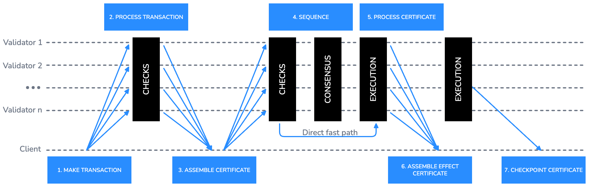

예시 diagram은 각 actor(Client, Validator 1부터 Validator n까지)에 horizontal swimlane을 사용하고 arrow 위에 numbered step label을 둔다. 이 diagram의 주요 decision은 다음과 같다.

- Client에서 모든 Validators로 향하는 fan-out arrow는 broadcast submission을 나타낸다.
- Vertical black bar는 processing phase(CHECKS, CONSENSUS, EXECUTION)를 나타내며, concurrent activity를 보여주기 위해 여러 swimlane에 걸친다.
- direct fast path는 arrow 위에 짧은 sentence-case annotation으로 inline 표시한다.
- Step number는 Sui Blue 500으로 arrow 위에 small ALL CAPS label로 배치한다.

더 단순한 actor-to-actor flow에는 traditional sequence diagram이 더 명확한 경우가 많다. 다음 예시는 client가 transaction을 submit하고, validator가 validate한 뒤 client에게 confirm하는 흐름을 보여준다.
 
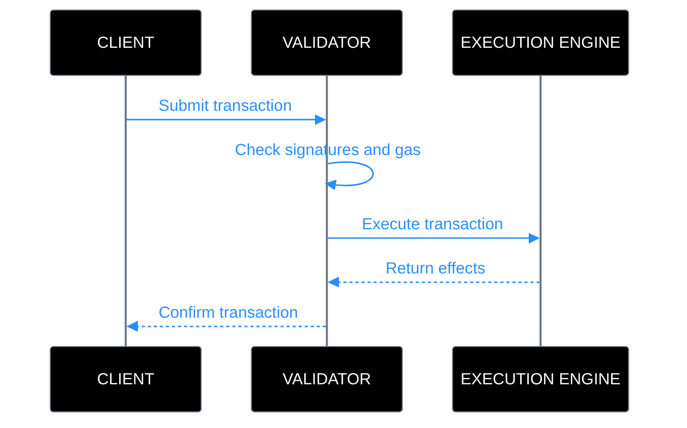

### Flowchart

Flowchart는 "이 process에는 어떤 decision과 step이 포함되는가?"라는 질문에 답한다. C4 Level 4(code)에 해당한다.

다음은 [Transactions overview](/develop/transactions/txn-overview) guide의 example flowchart를 재현한 예시다.


예시 diagram은 object(OBJECT A, OBJECT B, OBJECT C)를 Black 또는 Sui Blue 500 filled rectangle로 표시하고, arrow에는 transaction label(TX-1부터 TX-4까지)을, 각 node 내부에는 owner name을 sentence case sub-label로 표시한다. 이 diagram의 주요 decision은 다음과 같다.

- 각 object state는 자체 node이다. state change는 existing node를 mutate하는 대신 labeled arrow로 연결된 새 node로 표시한다.
- horizontal left-to-right progression은 transaction 전반의 time passing을 나타낸다.
- Gray 500 fill은 transaction의 byproduct로 생성된 object와 primary object를 구분한다.

flowchart에 conditional logic이 포함되면 decision point를 diamond node로 표현한다. diamond는 정확히 2개의 labeled exit을 가져야 한다. 각 exit에는 branch condition을 sentence case로 label한다(예: Valid와 Invalid, 또는 Yes와 No). decision node에서 나가는 모든 arrow에는 label이 있어야 한다. 다음은 transaction validation flow의 conditional node 예시다.
 
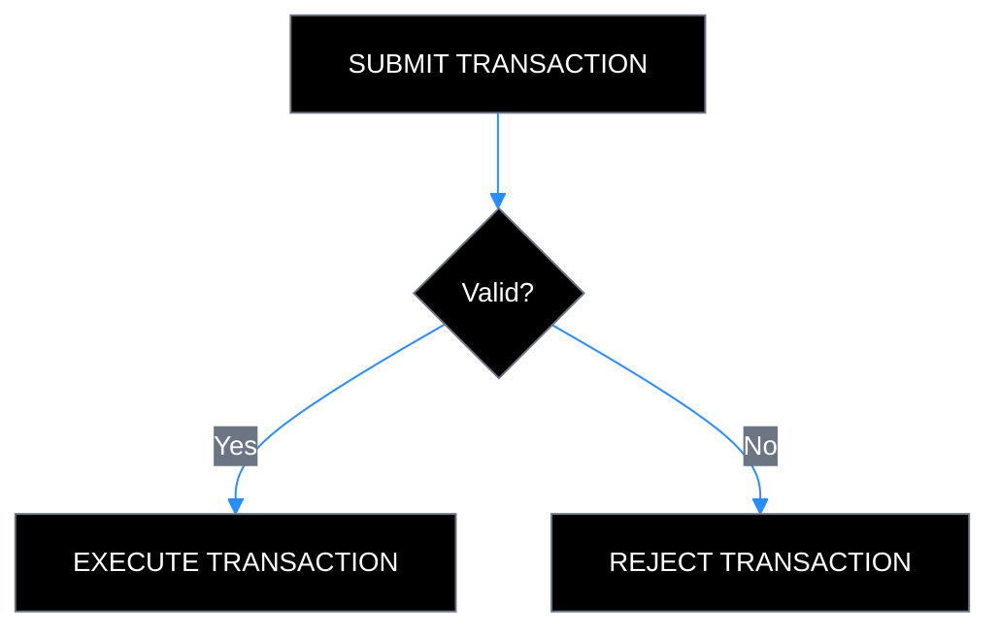

## 파일 및 export

diagram file naming, storing, exporting에는 다음 convention을 따른다.

### 파일 이름 지정

모든 diagram file에는 다음 naming pattern을 사용한다.

| **Pattern** | **Example** |
| --- | --- |
| `diagramtype_topic_v{n}.svg` | `architecture_data-serving_v1.svg` |
| `diagramtype_topic_v{n}.excalidraw` | `sequence_txn-lifecycle_v2.excalidraw` |
| `diagramtype_topic_v{n}.png` | `flowchart_object-transfer_v1.png`(export only) |

허용되는 diagram type prefix는 `architecture`, `sequence`, `flowchart`, `context`, `component`이다.

### source file

- diagram을 추가하거나 update하는 모든 pull request에는 exported PNG 외에도 editable source file(`.excalidraw` 또는 `.svg`)을 포함해야 한다.
- source file은 이를 reference하는 documentation page와 같은 directory에 저장한다.
- auto-generated 또는 minified SVG output을 source file로 commit하지 않는다.

### export checklist

diagram을 commit하기 전에 다음 export setting을 확인한다.

- **Background:** On.
- **Dark mode:** Off.
- **Scale:** production에는 3x, draft review에는 1x.
- **Format:** docs site에는 PNG, source에는 SVG.
- commit 전에 모든 text가 400px wide에서 readable한지 확인한다.

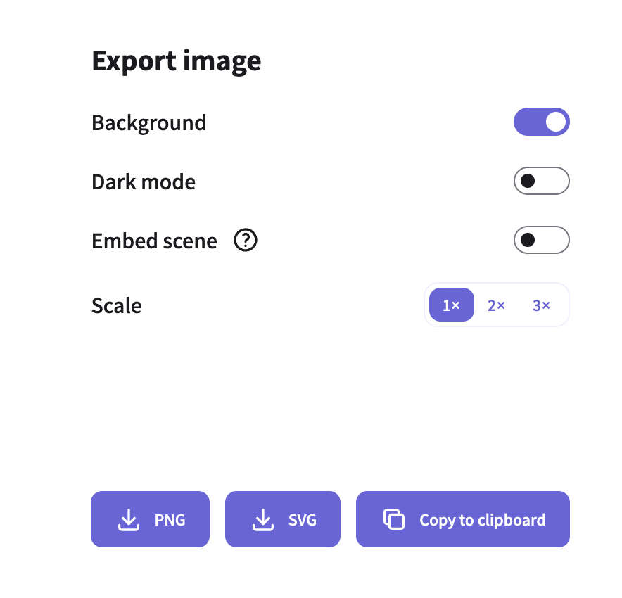
