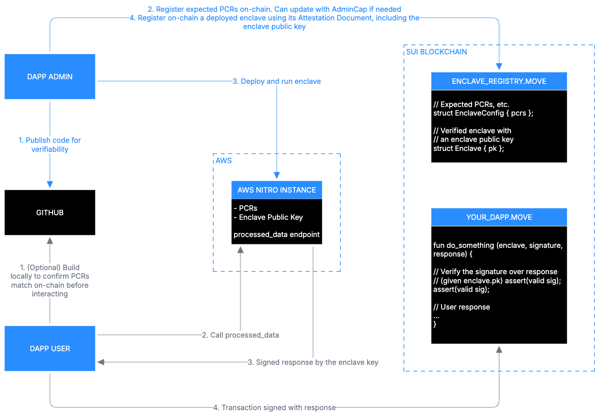

Enclave가 시작되면 3개의 HTTP endpoint를 expose한다:

1. `/health_check`: enclave가 허용된 external domain에 도달할 수 있는지 확인한다. Debugging에 사용된다.

1. `/get_attestation`: signed attestation document를 반환한다. Onchain registration 중에 사용된다.

1. `/process_data`: custom logic을 포함한다. 이 code는 직접 작성한다. App frontend가 호출하는 endpoint이다.

## Platform Configuration Register(PCR)

Enclave의 code와 configuration을 설명하는 세 개의 SHA-384 hash이다.

- **PCR0:** OS and boot environment

- **PCR1:** Application code

- **PCR2:** Runtime configuration (`run.sh`, traffic rules)

단일 byte라도 바뀌면 PCR이 바뀐다. 이것이 Sui가 enclave가 expected code를 실행 중임을 확인하는 방법이다.

## enclave 내부에서 일어나는 일

### Step 1: enclave 시작

Enclave는 isolated memory 안에서 새 ephemeral keypair를 생성한다. Private key는 enclave를 벗어나지 않으며 public key는 `/get_attestation`을 통해 반환된다.

### Step 2: enclave가 data sign

`process_data`가 `{ response, signature }`를 반환하면 enclave는 enclave private key를 사용해 `signature = sign( response )`로 data에 서명한다.

### Step 3: Move contract가 signature verify

Onchain Move contract는 signature가 registered enclave의 public key와 일치하는지, PCR이 올바른지, timestamp가 최근인지 확인한다. 모든 check가 통과하면 computation이 accept된다.

## smart contract의 역할

Move smart contract는 이 process에서 두 가지 일을 한다:

1. PCR을 저장하고 attestation document를 verify하며 enclave public key를 shared object 안에 저장하여 enclave를 register한다.

Move smart contract가 생성하는 example object type에는 PCR을 위한 `EnclaveConfig` object와 public key 및 metadata를 위한 `Enclave` object가 포함된다.

2. Signed response를 verify한다. Move app logic은 Nautilus Move library 안의 `verify_signature()`를 호출한다. Call이 valid이면 data가 accept되고 logic이 계속된다. 이는 app이 실제 authenticated enclave에서 온 data만 accept하도록 보장한다.

## Nautilus workflow

Nautilus에는 system을 build하고 deploy하는 app developer와 이에 interact하는 user라는 두 주요 participant가 있다. Framework는 user가 developer를 trust하지 않고 computation을 verify할 수 있는 trust model을 설정한다.

### 개발자 워크플로

App developer는 self-managed TEE를 deploy하려면 다음 단계를 따른다. 또는 Docker-based simplicity를 위해 [Marlin Oyster marketplace](/sui-stack/nautilus/community-dev-tools)를 사용할 수 있다.

1. [제공된 template](https://github.com/MystenLabs/nautilus)을 사용해 reproducible build가 있는 Nautilus offchain server를 만든다.

1. Transparency와 verifiability를 위해 server code를 GitHub 같은 public repository에 publish한다.

1. Instance의 platform configuration registers(PCRs)를 register한다. PCR은 trusted computing base의 measurement이다. Sui smart contract를 사용해 이를 register한다.

1. Server를 AWS Nitro Enclave에 deploy한다.

1. Sui smart contract와 attestation document를 사용해 deployed enclave를 register한다. Response signing을 위한 enclave의 ephemeral public key를 포함한다.

:::info

Gas cost가 높기 때문에 enclave registration 중에만 attestation document를 onchain에서 verify한다. Registration 후에는 더 효율적인 message verification을 위해 enclave key를 사용한다.

:::

Trusted computing base를 줄이려면 load balancing, rate limiting, 기타 관련 aspect를 처리하는 backend service를 통해 enclave access를 route한다.

### user workflow

User 또는 client application은 Nautilus enclave를 verify하고 interact할 수 있다:

1. (Optional) Nautilus offchain server code를 local에서 build하고 생성된 PCR이 onchain record와 일치하는지 확인하여 verify한다.

1. Deployed enclave에 request를 보내고 signed response를 받는다.

1. Corresponding application logic을 실행하기 전에 signed response를 onchain에 submit하여 verify한다.

## trust model

Nautilus trust model은 개별 developer나 service provider를 trust하지 않고 computation을 verify할 수 있게 한다. 이 verification은 cryptographic attestation과 reproducible build에 의존한다.

### attestation verification

AWS Nitro Enclave의 attestation document에는 AWS를 root certificate authority로 사용해 onchain에서 verify할 수 있는 certificate chain이 포함된다. 이 verification은 다음을 확인한다:

- enclave instance가 PCR value로 validate된 unmodified software를 실행 중이다.

- instance의 computation이 published source code와 일치하는지 independent하게 verify할 수 있어 transparency와 trust를 보장한다.

### reproducible build

Reproducible build를 사용하면 enclave instance 안에서 실행되는 binary가 source code의 특정 version과 일치하는지 verify할 수 있다. Source code가 public이 아닌 경우처럼 모든 use case에 reproducible build가 적용되지는 않을 수 있다.

이 approach는 다음 benefit을 제공한다:

- 누구나 binary를 build하고 compare하여 published source code와 consistency를 확인할 수 있다.

- Software 변경은 다른 PCR value를 만들어 unauthorized modification을 detect할 수 있게 한다.

- Reproducible build는 trust를 runtime에서 build time으로 옮겨 app의 overall security posture를 강화한다.

### TEE security 고려 사항

Nautilus는 software-level attack으로부터 보호하도록 설계된 cloud-based enclave를 사용한다. AWS Nitro Enclaves 같은 cloud-hosted TEE에 집중하는 것은 의도적이다. Cloud provider는 vulnerability에 빠르게 대응하고, security issue에 대한 early signal을 받아 효율적으로 patch할 수 있다. 또한 강력한 physical security를 유지한다. Cloud data center access는 엄격하게 통제되어 physical hardware attack risk를 줄인다. 마지막으로 엄격한 compliance standard 아래에서 운영된다. AWS와 GCP 같은 provider는 SOC 2, ISO 27001, CSA STAR 등의 framework에 대해 정기적으로 audit을 받아 operational integrity를 보장한다.

이 trust model이 application의 threat profile과 security need에 맞는지 평가하는 것이 권장된다.
